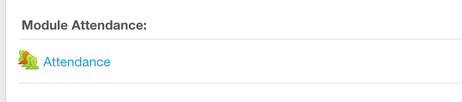

\title{\sessionnumber:  Code Review}
\subtitle{\modulecode: \moduletitle}

\frame{\titlepage} 

## Register Attendance


## Learning Outcomes 
After this session you will be able to:

- **Identify** the key aspects of maintainable code 
- **Apply** linters to source files
- **Conduct** a code review
- **Describe how** code could be improved

## Code Review
1
\


>"Peer review—an activity in which people other than the author of a software deliverable
examine it for defects and improvement opportunities—is one of the most powerful software
quality tools available." 

[Karl E. Wiegers - Humanizing Peer Reviews, 2002](http://www.processimpact.com/articles/humanizing_reviews.pdf)

## What to review 
- Avoid 'Not applicable here' (NAH) Syndrome
- Any size project can benefit from code review
- Review no more than 400 lines at a time
- 200 Line of code an hour (once familiar with code reviews)

## Difficulties
- Pressure on both reviewer and reviewee 
- Not instinctive behavior
- Honesty
- Fear of offending 
- Set aside your ego and pride
- Accepting critique (Don't take it personally
- Misunderstood as time consuming
- Too busy

## Benefits
- Shortened product development cycle time
- Less time spent performing rework
- Increased group programming productivity
- Better techniques learned from other developers* 
- Team cohesion
- Exchanging of information about components and overall system with other team members
- Better quality code base

[Karl E. Wiegers - Humanizing Peer Reviews, 2002](http://www.processimpact.com/articles/humanizing_reviews.pdf)

## Egoless Programming
A term first coined in 1971 by Gerald Weinberg - The Psychology of Computer Programming

> “egoless programming,” not “egoless programmer.” Developers
need a robust enough ego to trust and defend their work, but not so much ego that they reject
suggestions for better solutions. Similarly, the egoless reviewer should have compassion and
sensitivity for his colleagues, if only because their roles will be reversed one day.

[Karl E. Wiegers - Humanizing Peer Reviews, 2002](http://www.processimpact.com/articles/humanizing_reviews.pdf)

## Tips for reviewee
- Strive for quality
- RESPECT
- be receptive
- Reciprocate don't retaliate 


## Tips for reviewer
- RESPECT
- Avoid accusatory language
- Discuss the work not the author
- Be constructive with your criticism
- "Bugs are the bad guy" - Wiegers
- Identify the good as well as the bad

## Planning a Review

\includegraphics[width=0.5\textwidth, center]{assets/tick.png}


- Allocate time and resources 
- Create a check list
- No more than 60 mins at a time 
- Lock in scope
- Identify the lines for review


## ZEN

\includegraphics[width=0.5\textwidth, center]{assets/python.png}


```
import this
```

## Some helpful talking points 
```
>import this
```
\tiny

```{python, echo=FALSE}
import this
```

## Potential Issues: General

\includegraphics[width=0.5\textwidth, center]{assets/mag.png}

- Does it work? (CI and TDD later on in the course)
- Does the code follow the teams' prefered paradigms
- Optimisation 


## Potential Issues: Look and Feel
Did the author show respect for their code

- Repetition
- Shy code - loosely coupled (Pragmatic Programmer)
- Indentations
- Redundant code - delete it don't comment it out
- Blank lines
- Debuging code removed
- General Tidyness

## Readability

\includegraphics[width=0.5\textwidth, center]{assets/read.png}


- Consistent naming conventions
- Names reflect their purpose (variables, functions, classes...)
- Comments are consistent and appropriate
- Easy to follow the flow
- line lengths (79 chars ish)

## Potential Issues: Variables

\includegraphics[width=0.5\textwidth, center]{assets/bug.png}


- Consistent naming conventions
- Redundant variables
- Subtle bugs - wrong variables used
- limit global vars (none if possible)


## Potential Issues: Unforseen Issues

\includegraphics[width=0.5\textwidth, center]{assets/lock.png}

- Security issues
- Blockers further down the road
- Integration issues

## Potential Issues: Adherence to Style and Standards

\includegraphics[width=0.5\textwidth, center]{assets/bot.png}

- PEP8: Standard Python style guide
- PEP257: Docstrings
- Linting for all the things... 

## PEP8 Linting 
```
pip3 install pycodestyle
pycodestyle filename.py
```

- **--statistics** how often each error was found      
- **--show-source** shows the source where error occurs
- **--show-pep8** pulls in the PEP8 text for error


## PEP 257 Docstrings
[View Docs](https://www.python.org/dev/peps/pep-0257/) 


## Linting Docstrings

Checking Docstrings

```
pip install pep257
pep257 PetPEP257.py
```

## Review Your Way to Success

> "If you’re serious about the quality of your work, you’ll accept that you make mistakes,
seek the counsel of your compatriots in finding them, and willingly review your colleagues’
work products. You will set aside your ego so you can benefit from the experience and
perspective of your technical associates. When you have internalized the benefits of peer
reviews, you won’t feel comfortable unless someone else carefully examines any significant
deliverable you create."

[Karl E. Wiegers - Humanizing Peer Reviews, 2002](http://www.processimpact.com/articles/humanizing_reviews.pdf)

## PASS Challenge
- **Format and document** your submission
- Getting the file and folder structure right is important, it gives assessors more time to focus on useful feedback
- Then **submit** to the peer-review activity
- Submissions are group submissions (i.e., your pre-production teams)
- The submission must be a .zip file

## PASS Challenge
- One folder for each contract
- Each member of the team should have 'assumed ownership' of one contract
- Name the folder according to the contract
- Ensure the name of the 'owner' is included in the folder name
    + e.g. "Contract 1 - Scott"
    + e.g. "Contract 2 - Parker"

## PASS Challenge
- Add a README.md file alongside the contract folders
- Use [Markdown](https://www.markdowntutorial.com/) appropriately
- Describe the project
- For each member of the team, repeat who assumed ownership of each contract but here also include who else worked on it
- Then, again for each member of the team, clarify to assessors where the three or more algorithms/function are

## PASS Challenge
- Also add README.md files in each contract folder
- Use [Markdown](https://www.markdowntutorial.com/) appropriately
- Add a link to the repository used for version control
- Explain to assessors how to execute the code
- Add any other details you think neccessary
- Acknowledge and thank contributors to that contract

## PASS Challenge
- Include doc-strings in source files to clarify authorship
- Where appropriate, credit everyone who contributed and make clear who was driving
- If equal contributions (due to rotating driver/navigator), say so
- If present, reference third-party code
- Supply a link in the doc-string if any code has been taken from StackOverflow
