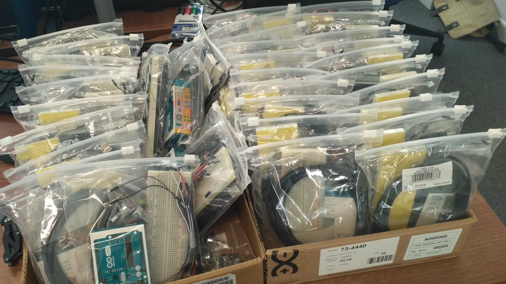
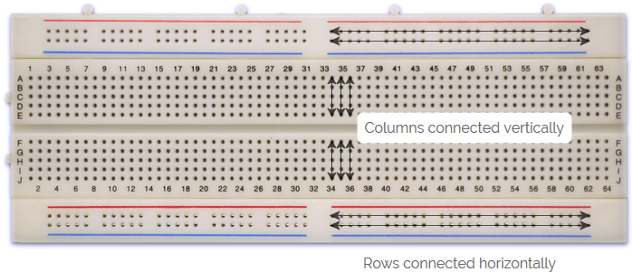
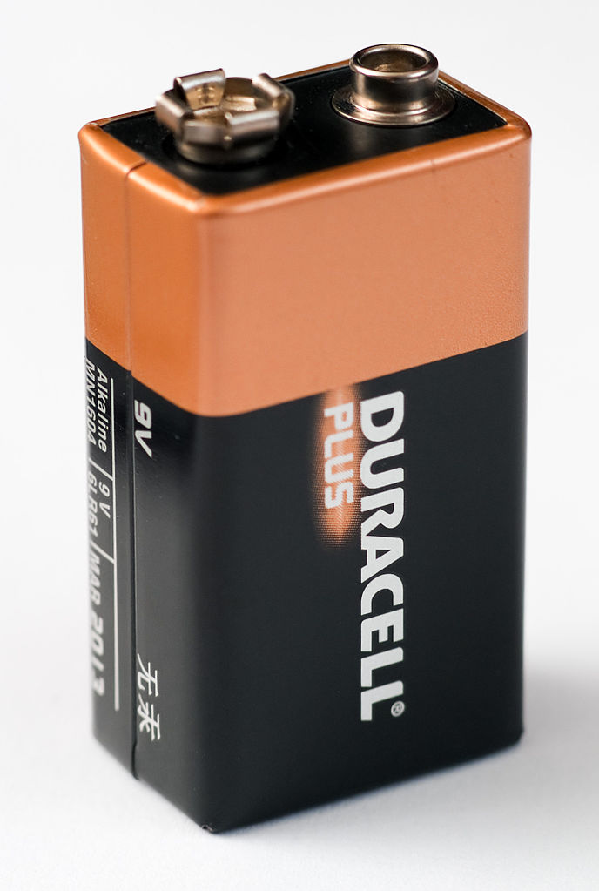
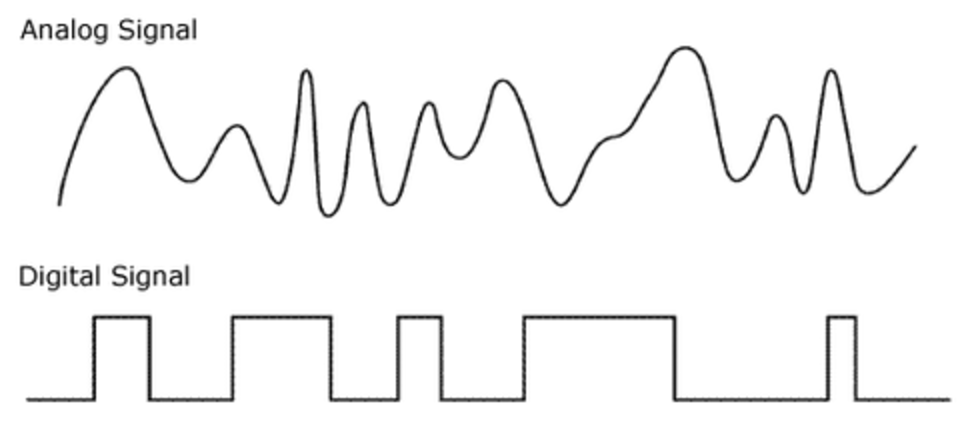
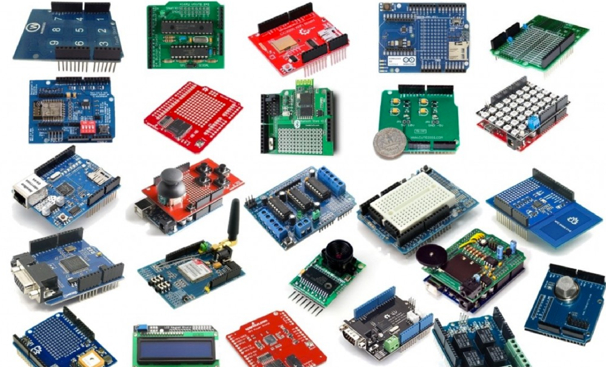
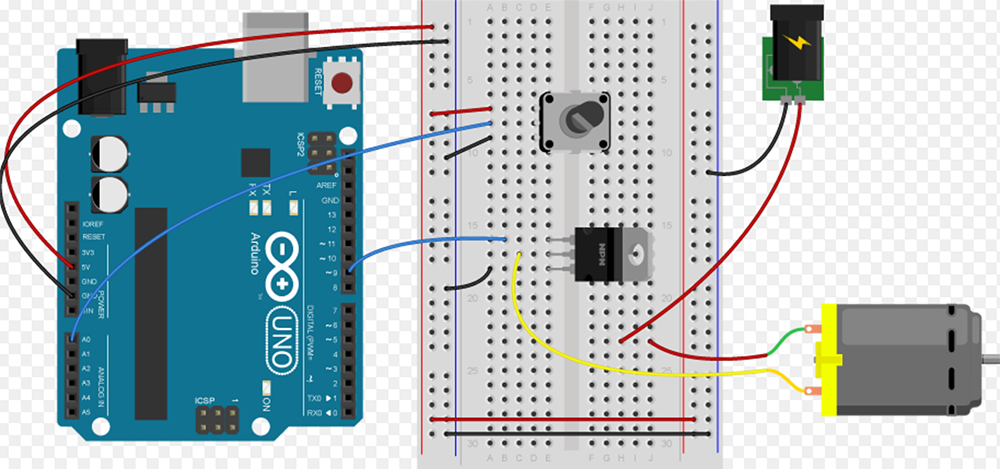

```{r setup, include=FALSE}
library(knitr)
knitr::opts_chunk$set(echo = FALSE, fig.align="center")
opts_knit$get("rmarkdown.pandoc.to")
html <- knitr::opts_knit$get("rmarkdown.pandoc.to") == "html"
```


```{r results='asis'}
if (!html) {
  cat("\\title{\\sessionnumber: An Introduction to Arduino} \\subtitle{\\modulecode: \\moduletitle} \\frame{\\titlepage} ")
}

#############
## CENTER 
out_type = knitr::opts_knit$get("rmarkdown.pandoc.to")

centerImage = function(asset, scale = 0.6){
  
  perc <- scale * 100
  
  if(out_type == 'latex' || out_type == 'beamer')
    paste("\\begin{figure}\n \\includegraphics[width=", scale, "\\columnwidth]{", asset, "}\n \\end{figure}", sep="")
  else if(out_type == 'html')
    paste("<center>\n{ width=", perc, "% }\n</center>", sep="")
  else
    asset
}
```

## Register Attendance


## Learning Outcomes {.build}
After this session you will be able to:

- **Identify** the various parts of the Arduino and their function
- **Explain** the difference between analog and digital
- **Follow** the Arduino tutorials to create basic functionality

## Arduin Kits




## What's in the Bag?
Come up and collect your components:

- **3x** 220ohm Resistors (ish)
- **1x** 10k Resistor
- **5x** LEDs (red, green, blue, yellow \& white)
- **2x** Potentiometer
- **1x** Push Button
- **1x** Bread Board
- **1x** USB Cable
- **1x** Arduino
- **1x** Bunch of hook up wires

## Breadboard

  


## Resistor
`r centerImage("assets/resistor.png") `

In electronic circuits, resistors are used to reduce current flow, adjust signal levels and divide voltages.

## Light Emitting Diode (LED)
`r centerImage("assets/led.png")` 

LEDs, being diodes, will only allow current to flow in one direction. And when there's no current-flow, there's no light. Luckily, this also means that you can't break an LED by plugging it in backwards. Rather, it just won?t work.

# Potentiometer (variable resistor)

`r centerImage("assets/pot.png")` 

Potentiometer is a small sized electronic component whose resistance can be adjusted manually. Increasing or decreasing the value of resistance controls the amount of current flowing in a circuit.
	
## Button

`r centerImage("assets/butt.png", 0.5)`

A device for making and breaking the connection in an electric circuit.

## Atmel ATmega328P
`r centerImage("assets/atmega328p.jpg", 0.8)`

## Block Diagram
`r centerImage("assets/block.jpg", 0.9)`

## Flash
`r centerImage("assets/flash.png", 0.8)`

## SRAM
`r centerImage("assets/sram.png", 0.8)`

## EEPROM
`r centerImage("assets/eeprom.png", 0.8)`

## CPU
`r centerImage("assets/cpu.png", 0.8)`

## Clock
`r centerImage("assets/clock.png", 0.9)`

## Ports
`r centerImage("assets/ports.png", 0.8)`

## ADC
`r centerImage("assets/adc.png", 0.8)`

## USART
`r centerImage("assets/usart.png", 0.8)`

## SPI
`r centerImage("assets/spi.png", 0.8)`

## What is an Arduino?


## Final Form Factor
`r centerImage("assets/diy.png", 0.8)`

## Space
`r centerImage("assets/sat.png")`

The ArduSat satellites are powered by the Arduino Uno. It follows cube satellite (CubeSat) standards to build compact 10 cm cubes that can easily be sent to orbit. 

## Sea

`r centerImage("assets/sea.png")`

The robotic prototype swimming under water propelled by fins, it was developed at the Control Systems and Robotics Laboratory of the Technological Educational Institute of Crete, in Heraklion (Greece) and it's controlled by an Arduino Mega.

## Philharmonia MusicLab
`r centerImage("assets/musiclab_01.png", 0.8)`

## Philharmonia MusicLab
`r centerImage("assets/musiclab_02.jpg", 0.8)`
	
## Philharmonia MusicLab
`r centerImage("assets/musiclab_03.jpg", 0.8)`

## Philharmonia MusicLab
`r centerImage("assets/musiclab_04.jpg", 0.8)`

## Philharmonia MusicLab
`r centerImage("assets/musiclab_05.jpg", 0.8)`

## Sensors \& Actuators 
`r centerImage("assets/nxt.png")`

Just another input / output controller

## Why Arduino?
- Open Source
- The Arduino is a small microcontroller board
- Basically, a small computer 
- Perfect for rapid prototyping physical computing systems
- Arduino Uno is based on the Atmel ATmega328P

## The basics
The Arduino can only process electronic signals. This means that stimuli from the physical world need to be transduced to electrical signals before they can be processed from within your code. 

- 14 Digital IO pins (0-14)
- 6 Analogue in pins(0-5)
- 6 Analogue out pins(3,5,6,9,10, and 11) ~

## Technical specs

`r centerImage("assets/spec.png")`
A more in depth version of what the Arduino Uno has to offer()

## Power
You can power the board using a USB port or DC power supply such as a 9v battery. The Arduino will default to the external power supply if there is one available.
{ width=20% }

## Analogue vs. Digital Signal
What is the difference? 
	
## Analogue vs. Digital Signal


## Analogue Out - PWM
`r centerImage("assets/pwm.png")`

## Serial Communication

Serial communication on pins TX/RX uses TTL logic levels (5V or 3.3V depending on the board).

It communicates on digital pins 0 (RX) and 1 (TX) as well as with the computer via USB. Thus, if you use these functions, you cannot also use 

pins 0 and 1 for digital input or output. 

Serial is used for communication between the Arduino board and a computer or other devices. 
	
## Arduino

`r centerImage("assets/map.png", 0.8)`
	
## Shields



## Open Source Game Boy Clone
`r centerImage("assets/gameboy.jpg", 0.5)`


## Places to buy components
Insure that you buy your components from UK sellers, especially on Ebay

`r centerImage("assets/shops.png", 0.8)`
		

## Driving Large Loads
	See spec
  
  
## Reverse Voltage
The Arduino should be protected from reverse voltage of solenoids, relays, motors and any other component that use coils. This can be done using a Diode. They act as a one way valve to channel the electric back into the coils. 

`r centerImage("assets/motor.png")`

## Mains Electricity
There is never any reason why you should be working with mains electricity supply - stay below 12v and even then take care.

`r centerImage("assets/nxt.png")`(assets/motor.png)


## Programming for Arduino
The Arduino language is merely a set of C/C++ functions that can be called from your code. Your sketch undergoes minor changes (e.g. automatic 	generation of function prototypes) and then is passed directly to a C/C++ compiler (avr-g++). 

[https://www.arduino.cc/en/Reference/HomePage](https://www.arduino.cc/en/Reference/HomePage)


## HELLO ARDUINO
`r centerImage("assets/hello.png")`
