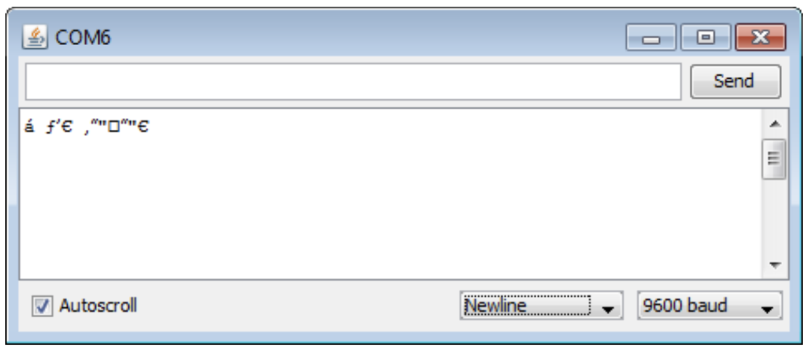
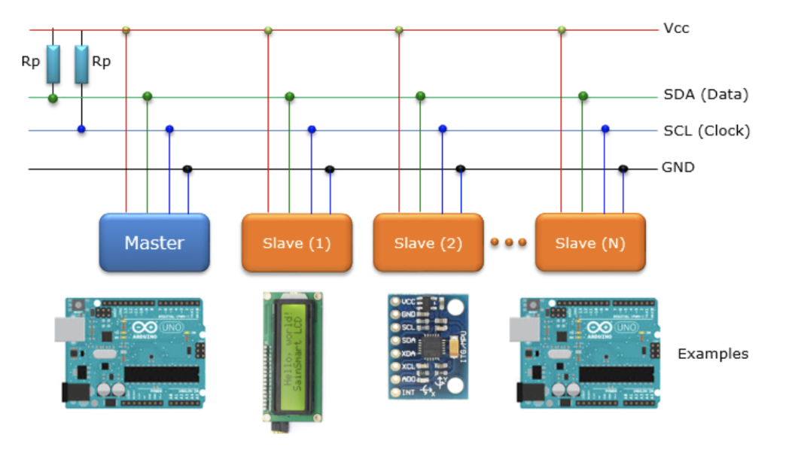
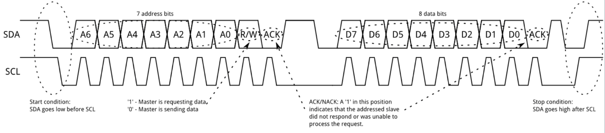
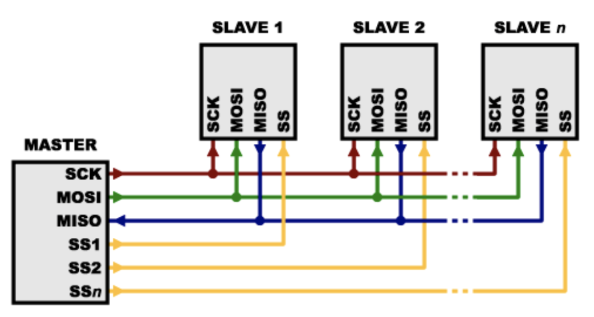
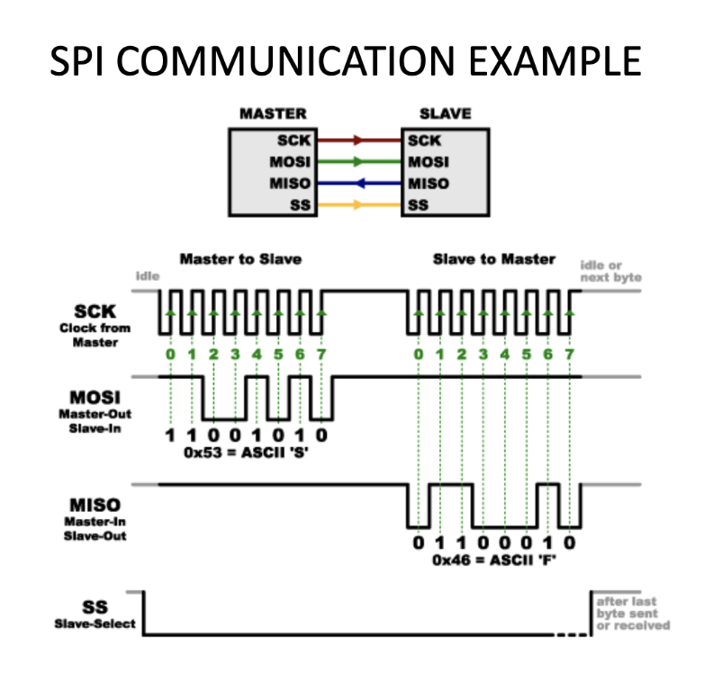
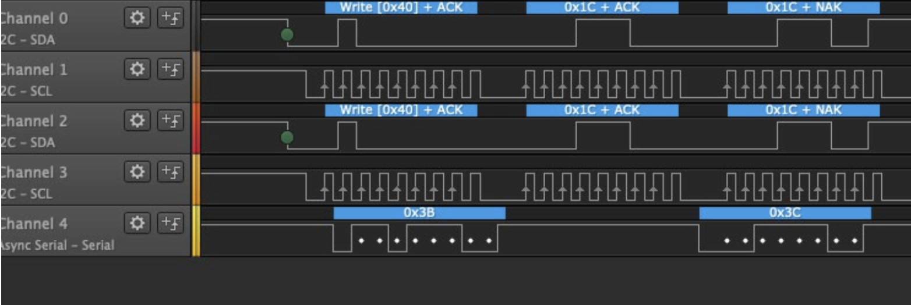
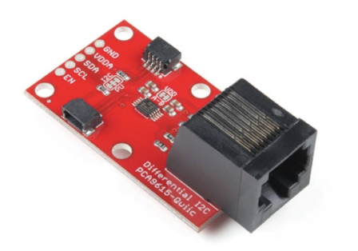
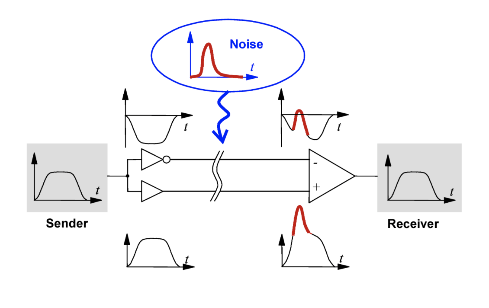

```{r setup, include=FALSE}
library(knitr)
knitr::opts_chunk$set(echo = FALSE, fig.align="center")
opts_knit$get("rmarkdown.pandoc.to")
html <- knitr::opts_knit$get("rmarkdown.pandoc.to") == "html"
```


```{r results='asis'}
if (!html) {
  cat("\\title{\\sessionnumber: Hardware Interfaces} \\subtitle{\\modulecode: \\moduletitle} \\frame{\\titlepage} ")
}

#############
## CENTER 
out_type = knitr::opts_knit$get("rmarkdown.pandoc.to")

centerImage = function(asset, scale = 0.6){
  
  perc <- scale * 100
  
  if(out_type == 'latex' || out_type == 'beamer')
    paste("\\begin{figure}\n \\includegraphics[width=", scale, "\\columnwidth]{", asset, "}\n \\end{figure}", sep="")
  else if(out_type == 'html')
    paste("<center>\n{ width=", perc, "% }\n</center>", sep="")
  else
    asset
}
```
```

## Register Attendance


## Learning Outcomes {.build}
After this session you will be able to:

- **Select** the appropriate method for communication 
- **Outline** the difference between I2C and SPI
- **Implement** a hardware interface between the Arduino and a sensor

## What is Serial Communication?

- Arduino to Multimedia Computer (retro term alert) 
- Arduino to Arduino 
- Arduino to sensors


## Types of Serial Communications

- **I2C**
- RS232
- **USB**
- R2422
- CAN
- Microwire
- RS485
- **SPI**
- **TTL**

## Protocols

A protocol is the language that governs communication between systems or devices.

- Midi
- DMX-512
- X10
- USB
- RS485
- UDP/IP
- TCP/IP

## Serial/UART 

As mentioned previously...

- This is how an Arduino talks to a computer
- Arduino has an onboard UART to Seral Converter
- Requires an agreed baud rate: Serial.begin(9600)
- Two communication lines - RX to receive and TX to transmit
- TX connects RX, RX to TX
- Used by some peripherals such as Bluetooth modules

##  When Time Goes Wrong


## Inter-Intergrated Circuit (I^2^C)

- Pronounced I Square C
- Uses a clock Signal 
- Two communication lines - SDA (data) and SCL (clock)
- Multiple I^2^C devices can communication on the same data lines (bussed)
- Slave devices have an address

## I^2^C Bus Example


## Wire Library
- I^2^C Library for Arduino
- Arduino can be either host of slave
- Particularly useful for wired Arduino-to-Arduino communication

## I^2^C Communication Example


## Serial Peripheral Interface (SPI)

- Uses a clock signal
- Requires 4 lines 
+ MISO - master in slave out
+ MOSI - master out slave in
+ SCK - serial clock
+ CS - chip select
- Not addressed - each slave device requires a discrete chip select line. 

## SPI Bus Example


## SPI Communication Example


## Logic Analysers

- Not doing what you expect? Spy on them! 
- Logic analysers are the digital equivelant of an oscilloscope
- Can have up to 8 signal capture lines 
- Capture digital logic (HIGH or LOW)
- Easy to connect to existing circuits
- USB connection for data capture
- We have a couple in the Games Academy

## Logic Analyser Software


## Differential Signal

- Low voltage signals are susceptible to noise over long distance
- Noise can turn a digital 1 into a 0 
- Differential Signal is one solution
- Used by USB and in professional audio
- The hardwork is done for you: PCA9615 chip converts I^2^C to diff



## How does Differential Signal Work?
- Two lines carry the same signal, but one is inverted
- The two lines cancel each other out
- All that is left is the noice
- The noise is then cancelled out




