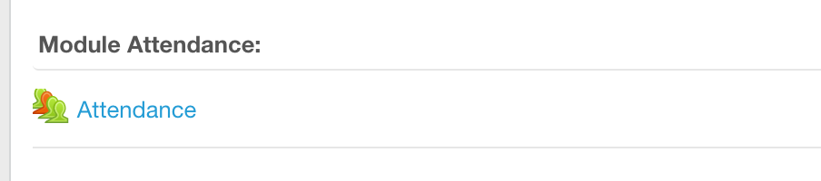
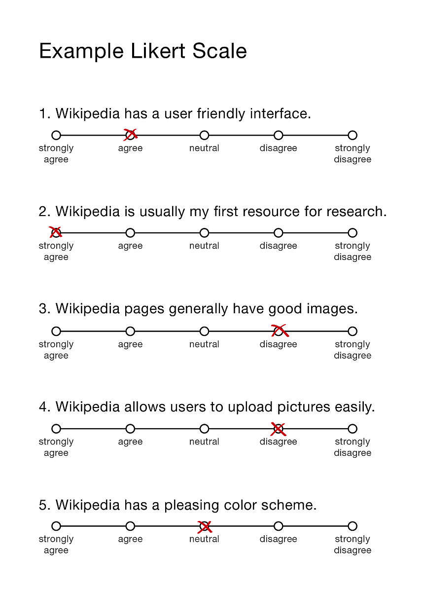

```{r setup, include=FALSE}
knitr::opts_chunk$set(echo = FALSE)
```

# Session 2: Data Collection for Evaluating Interfaces & Interactions

### Register Attendance


### Learning Outcomes
* **Select** the right participants for a HCI study
* **Consider** the participants needs
* **Conduct** Interviews and focus groups correctly

## Human Subjects - Human Considerations

### Who?
* Is the system designed for experts or more general users?
* Are the participants the independent variable? (age, gender, height)

**General**

* Appropriateness / Target Audience
* Individual's goals, background and motivations
* Technical Competency
* Gender
     
Gaming Specific
- Gaming Expertise
- Gaming Preferences

### Numbers
- Cost vs benefit
- Time required per participant
- Dependent on the type of research and design of the study
- Cook & Campbell - Classic Reading [[Find it here]](https://moodle2.units.it/pluginfile.php/132646/mod_resource/content/1/Estratto_ShadishCookCampbellExperimental2002.pdf)

### Large Numbers
- Usually involve a diverse range of participants
- Outcome is separate from the individuals
- Expensive
- Complex

### Small Numbers
- More participants = More statistical power
- Usability Test - 5 people are enough? (Nielsen & Molich 1990)
- Studies with 12 participants are not uncommon
- 20+ are better

### Individual
- Inexpensive
- Limited
- Non-representative
- Not statistically significant
- Helpful on a personal level - auto ethnography

### Recruitment
- Dependent on Study
- Games Academy FTW
- GDPR
- Commensurate Incentivisation (pizza ++)
- Over-recruit if you can

### Protecting the Participant
- Informed Consent (Usually, a signed form)
- Respect and Trust
- Respect for the individual, beneficence (moral obligation) and justice (benefits are for all and not just one privileged group) (National Commission for the protection of Human Subjects of Biomedical and Behavioural Research, 1979)  

- Privacy
    + Image and video - Protect identities where possible
    + Data Storage (GDPR again!)
    + Consider Dissemination throughout


### Institutional Review Boards (IRB)
- Most institutions that engage in research have an ethics review board
- Approval is needed to begin the research (NOT IN THIS MODULE)
- Falmouth University Policy can be found [HERE]( https://www.falmouth.ac.uk/sites/default/files/download/research_ethics_policy-13nov15.pdf)


### Qualitative, Quantitative & Mixed Method

- **Qualitative:** (qual) data, collects information that seeks to describe a topic more than measure it. Think of impressions, opinions, and views. A qualitative survey is less structured: It seeks to delve deep into the topic at hand to gain information about people’s motivations, thinking, and attitudes. While this brings depth of understanding to your research questions, it also makes the results harder to analyze.
- **Quantitative:** (quant) data is designed to collect cold, hard facts. Numbers. Quantitative data is structured and statistical. It provides support when you need to draw general conclusions from your research. [(source)](https://www.surveymonkey.com/mp/quantitative-vs-qualitative-research/)
- **Mixed Method:** A study that combines the two[(Useful reading)](     http://didier-jourdan.com/wp-content/uploads/2017/04/MM-and-Graduates-students.pdf)

### User Research Methods

Qualitative                   | Quantitative
----------------------------- | ------------------------
Interviews                    | Automated Data Collection
Focus Groups                  | Physiological Data
Diaries                       | Eye Tracking
Camera Study                  | Task Analysis
Surveys                       | A/B testing
Heuristic Evaluation          | Bench Marking
Cognitive Walkthroughs        | Surveys
Ethnographic Field Study      | Click Stream Analysis
Think Aloud Protocol          | System Usability Scale (SUS)[^1]


[^1]:More information on SUS can be found [here](https://moodle2.units.it/pluginfile.php/132646/mod_resource/content/1/Estratto_ShadishCookCampbellExperimental2002.pdf)


# Surveys 

### What is a Survey?
> "In short, it is a well defined and well-written set of questions to which an individual is asked to respond" 

(Lazar et al., 2017)

* Often used, hardly ever done well
* Easy to generate data that is not relevant or valid
* Misconceived as easy
* Require pilot test
* Good for measuring attitudes, awareness, intent, and getting feedback

### Pros & Cons

Pros | Cons
----------------------------- | ------------------------
Large Sample Groups  | Hard to refine
Low Cost  | No follow-up questions
Help to understand a population | Shallow understanding
Distributed Easily  | 
Easy to get approval | 
Good for factual information  | Suffer from recall bias [^2]

[^2]: [Recall Bias](https://en.wikipedia.org/wiki/Recall_bias)

### Question Design
Questions must be:

* balanced & non biased 
* Easy to understand by the participant

There are three main types of question.

* Open-ended
* Closed-ended - ordered response
* Closed-ended - unordered response

### Open-Ended
> "Open-ended questions are useful for getting a better understanding of phenomena, because they give the respondant complete flexibility in their answers"  

(Lazar et al., 2017)

**Considerations**  

- Extra care is needed to extract the right information
- Provide sufficient detail 
- Avoid ambiguity 

***

**Bad:** How did you feel about the drop-down menu interface? 

**Good:** list the issues you faced when trying to navigate using the drop-down menu interface?

More specific to the needs of the study.

### Closed-Ended 
Closed ended questions constrain the users answers within a range of choices designed by you. 

- **Ordered:** one of more answers can be selected in some logical order. 
- **Unordered:** One or more answer can be selected with no relationship between each other.

### 



### Sampling
A census is generally considered impossible. Instead, we do probabilistic (random) sampling. This gives us a general picture of the attitudes or feeling of a certain population.

**EXAMPLE**

In a study designed to gauge student attitudes towards food served in the Stannary, it would be unrealistic to expect to reach out to every student (5000+) and achieve a 100% response rate. Instead, you might take a random slice of 10%. 

### Targeted Users
* Consider the targeted respondents 
* Set clear Limits (inclusion/exclusion criteria)
* Identify communities of interest
* Decide on a dissemination plan

### Pilot Test
**DO NOT** release a survey into the wild without running some pretesting! 

- Review: Get the the survey checked by other experts
- Test: Find a very small sample 3-5 and run hybrid interviews
- Pilot: release the survey to a small test sample 

The pilot study can be the difference between useful data and nonsense!

### \color<1>[rgb]{1,0,0} Common Mistakes
- Double Barreled Question 
- Bias/loaded words (avoid overly negative or positive sounds words)
- Provocative language such as "liberal", "terrorism", "conservative"...
- Assuming prior knowledge
- Inadequate response options (frustrate the user)
- Lengthy survey 

### Overall Survey Design
- It is useful to be explicit about the inclusion criteria within the survey
- grouping is helpful
- Questions don't exist in a vacuum 
- Order and flow is important
- keep it as short as possible
- Place sensitive questions towards the end of the survey
- Always provice attribution so the participant knows who you are and how to contact you

### Why Reinvent the Wheel?

Find an existing tool and apply it to your study. You may need to modify the questions to better suit your goals. 

- Computer System Usability Questionnaire (CSUQ)
- Interface Consistency Testing Questionnaire (ICTQ)
- Perdue Usability Testin Questionnaire (PUTQ)
- Questionnaire for User Interaction Satisfaction (QUIS)
- Software Usability Measurement Inventory (SUMI)
- System Usability Scale (SUS)

Always check the validity of existing surveys through peer reviewed evalation before utilising it in your own study! 
