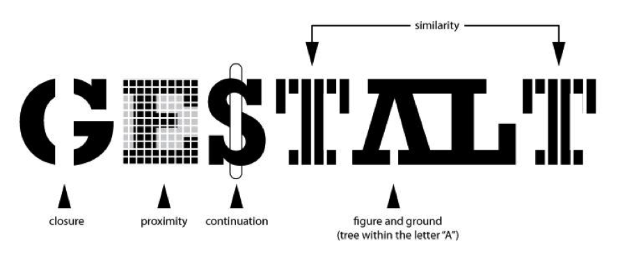
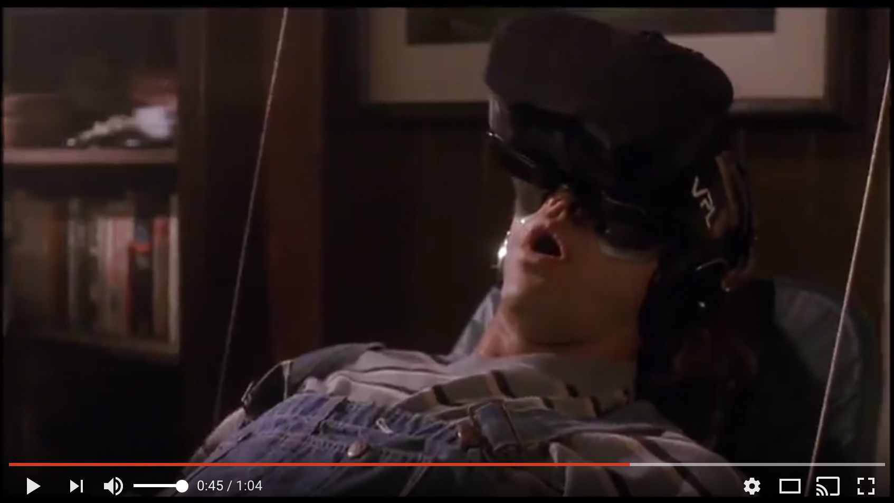
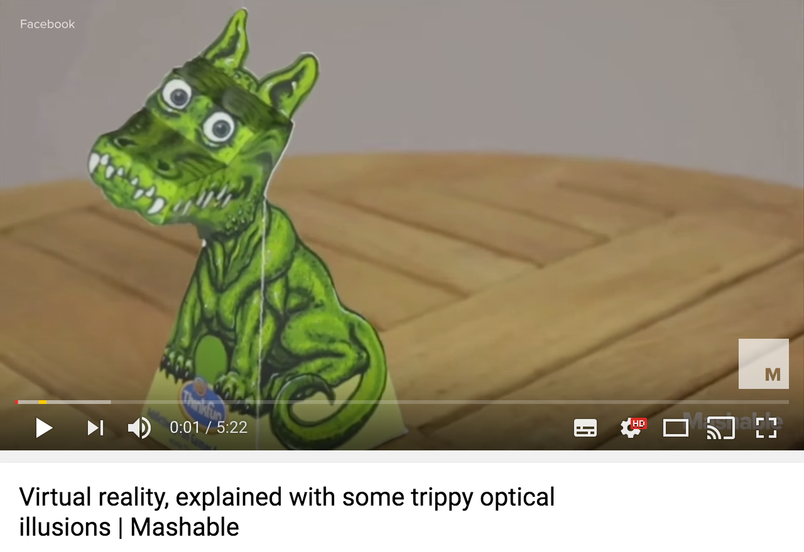
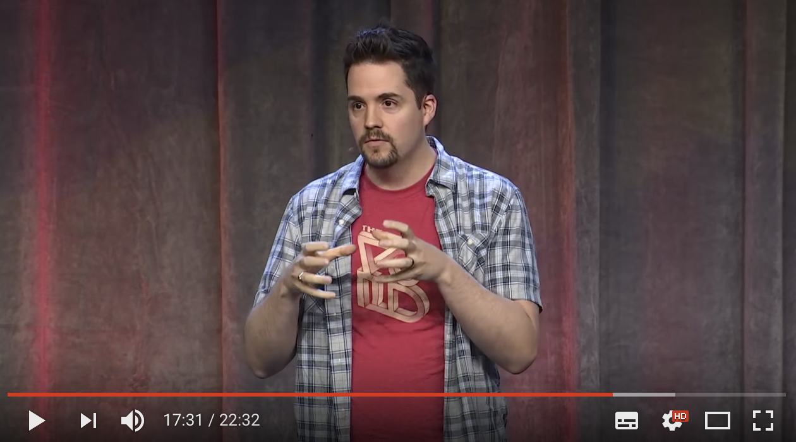
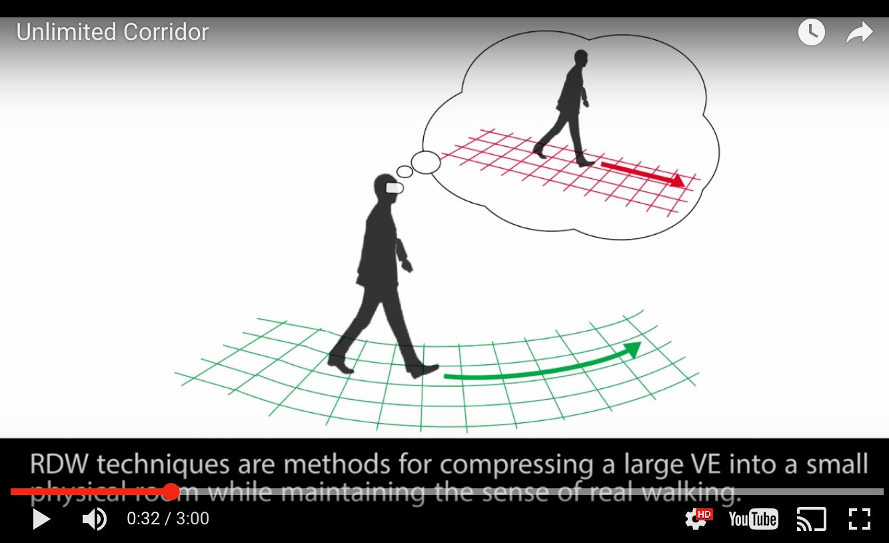
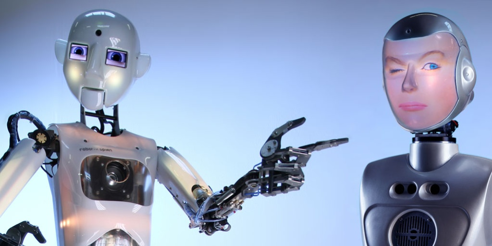
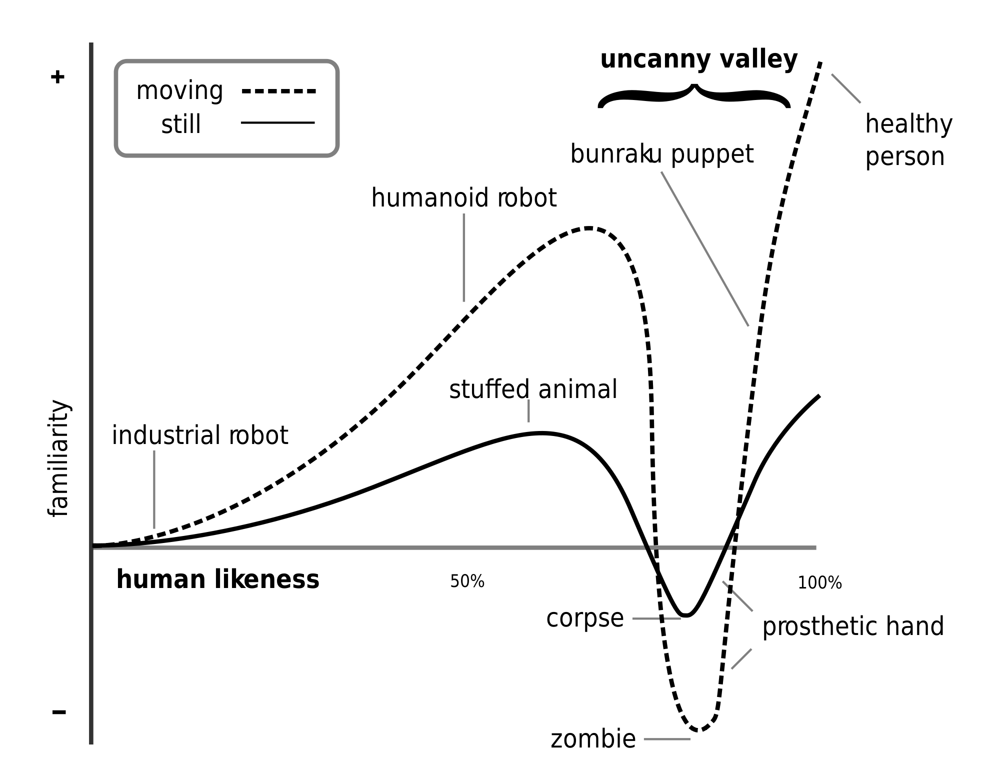

```{r setup, include=FALSE}
library(knitr)
knitr::opts_chunk$set(echo = FALSE, fig.align="center")
opts_knit$get("rmarkdown.pandoc.to")
html <- knitr::opts_knit$get("rmarkdown.pandoc.to") == "html"
```

```{r results='asis'}
if (!html) {
  cat("\\title{\\sessionnumber: Presence} \\subtitle{\\modulecode: \\moduletitle} \\frame{\\titlepage} ")
}

#############
## CENTER 
out_type = knitr::opts_knit$get("rmarkdown.pandoc.to")

centerImage = function(asset, scale = 0.6){
  
  perc <- scale * 100
  
  if(out_type == 'latex' || out_type == 'beamer')
    paste("\\begin{figure}\n \\includegraphics[width=", scale, "\\columnwidth]{", asset, "}\n \\end{figure}", sep="")
  else if(out_type == 'html')
    paste("<center>\n{ width=", perc, "% }\n</center>", sep="")
  else
    asset
}
```

## Register Attendance


## Learning Outcomes 
After this session you will be able to:

- **Define** presence in the context of virtual reality
- **Identify** a range of illusions and their roles in achieving a sense of presence
- **Describe** the way in which the brain processes \& responds to stimuli

##
>"We see things not as they are, but as we are - that is, we see the world not as it is, but as moulded by the individual peculiarities of our mind" 

Philosopher, G.T.W Patrick. (1890)
	
Reality is malleable
Our point of view is inseparable from our understanding of reality	


## Gestalt Psychology
[  ](http://graphicdesign.spokanefalls.edu/tutorials/process/gestaltprinciples/gestaltprinc.htm)  

> "Your brain is going to work overtime to keep a consistent, sensible world view." 

[Dr. Kimbery Voll, Riot Games](https://www.youtube.com/watch?v=-owQfn-iYQw)
	
##
[  ](https://www.youtube.com/watch?v=zTrgHXNAs24)

## Duck Test
> "A colloquial name for a method of testing if an experiencer has reached a state of presence, by monitoring their behaviour when threatened by a virtual object"
	
(VRGlossary.org)[http://www.vrglossary.org/glossary/duck-test/] 

## Presence (again)
> "Presence is the psychological state of subjective perception in which even though part or all of an individual's current experience is generated by and/or filtered through human-made technology, part or all of the individual's perception fails to accurately acknowledge the role of the technology in the experience." 
	
(International Society for Presence Research, 2000)[http://ispr.info]

## 
[  ](https://www.youtube.com/watch?v=qD3w3cAhEYU)


## Types of Illusion

- Boundary Completion
- Blind Spot [(link to eye)](http://snowbrains.com/wp-content/uploads/2013/07/eyeball.jpg){ }
- Depth Illusions [Trompe-l'oe il](https://www.youtube.com/watch?v=QmMTwjUdqbg)
- Afterimage
- Motion Illusions - Watch these in VR as they cause motion sickness. 

## Illusions 
V/AR are illusion based experiences
	
There are four main components to this illusion:
- the stable spacial place,
- self-embodiment,
- physical interaction \&,
- social communication.

## Sensation vs. Perception 

[  ](https://youtu.be/Ebwtq1HZJ2A?t=1051)

##
**Sensation** - Lower level recognition of stimuli. 

**Perception** - Higher level processing that combines information from the senses, filters it, organises it then interprets it to create **subjective**, conscious experience. 

**By this point we are starting to get a sense that what we perceive is not necessarily real. So what is getting in the way of reality?** 

## Iterative Processing
We continually receive, process and perceive stimuli in an iterative loop

`r centerImage("assets/iterative.png")`

## NLP - Communication Model
The Neuro-Linguistic Programming communication model is one way to describe how we as humans respond to external stimuli.

`r centerImage("assets/nlp.png")`

## Filters

- **Deletion**: delete unimportant incoming stimuli so we can focus on whats important.
- **Distortion**: alter our perception of incoming stimuli based on our environment and passed experience. 
- **Generalisation**:draw global conclusion and help the user build their **unconscious competence**


## Internal State
Thoughts are created from incoming filtered incoming stimuli and form internal representations

Sensory perceptions are formed that may or may not be true to the original stimuli

Emotional States are then triggered which in turn trigger physiological states and this is the motivation behind human behaviour

## Sensory Substitution

Sensory substitution is the replacement one sensory cue that is not yet able to be simulated with one that is. 

- **Ghosting** - showing the user a second version of a virtual object. 
- **Highlighting** - Visual signifiers that convey a sense of interactivity with an object.
- **Audio cues** - Useful for identifying collisions with virtual objects.  
- **Passive haptics** - Real world reference frames meet virtual reference frames to help a user navigate a space. 
- **Rumbles/sub packs** - Again, used to portray a collision with virtual objects. 

## Redirected Walking

[  ](https://www.youtube.com/watch?v=THk92rev1VA)

## Misdirection
> "That which directs a spectator away from the method and towards the effect"

- Curtis Hickman - Magician & founder of THE VOID.

TRUTH/REALITY > GUIDED PERCEPTION > LIE/FANTASY 
(Link)[https://www.youtube.com/watch?v=Ebwtq1HZJ2A]

## Homuncular Flexibility

`r centerImage("assets/hom.png", .4)`

The ability to, "learn to inhabit strange and different bodies and still interact with the virtual world." [Jaron Lanier](https://www.edge.org/response-detail/11182)

## [Proteus Effect](https://en.wikipedia.org/wiki/Proteus_effect) 

When an individual believes that others will expect certain behaviors from them because of their avatars' appearance, they will engage in those expected behaviors.

Nick Yee and Jeremy Bailenson at Stanford University in June 2007

- behavioral confirmation:  Expectation
- self-perception: Behavior and situation
- deindividuation: Grouping 

## The Uncanny Valley


##


## Fidelity Continua
The notion of the uncanny valley applies to aspects of VR as well. These components have been defined as the Fidelity Continua. 
	
- **Representation** fidelity - Hyper-realistic to abstract and non-objective worlds. 
- **Interaction** Fidelity - Degree to which a interaction in VR corresponds with the same interaction in the real world.
- **Experiential** Fidelity - The degree to which the user experience matches the intentions of the VR creator. Procedural worlds have a very low experiential fidelity.


## ACTIVITY 
> ["Rapid is a State of Mind"](https://www.gamasutra.com/view/feature/130848/how_to_prototype_a_game_in_under_7_.php?print=1)


Create a rapid low fidelity prototype that captures an essence of your VR/AR game mechanic but in a tradition video game manner. 

Avoid:

- Tricky, sophisticated data structures and algorithms.
- Sophisticated systems and architectures.
- Technical feats that do not improve gameplay.


