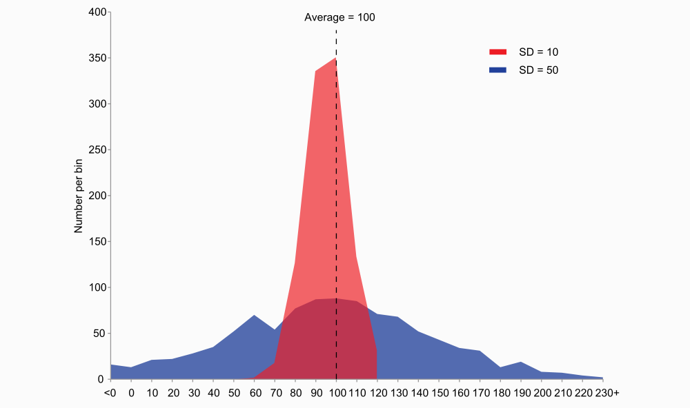
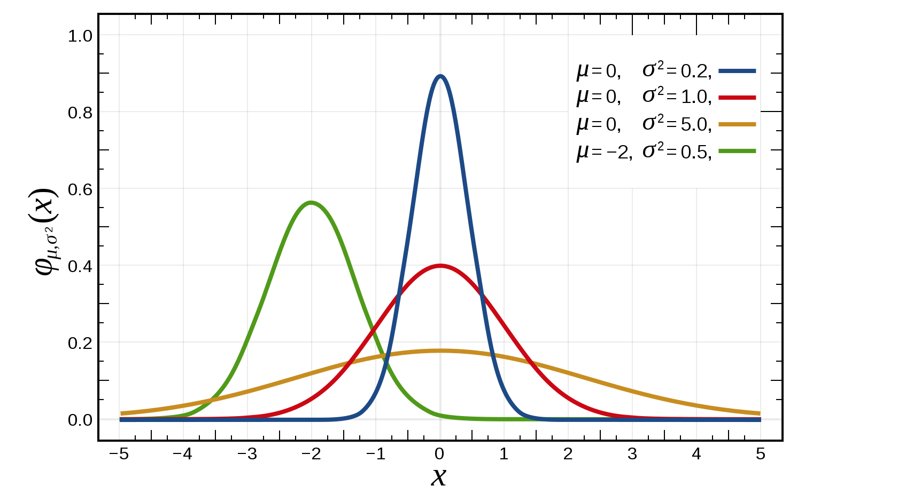
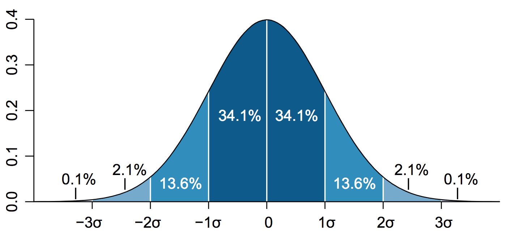
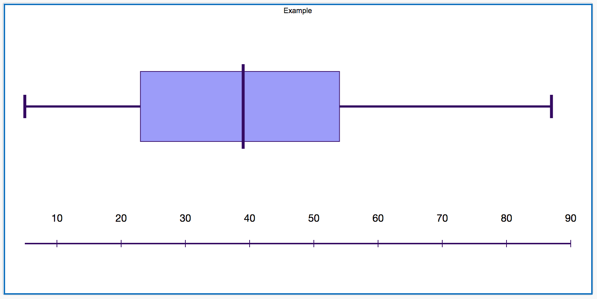
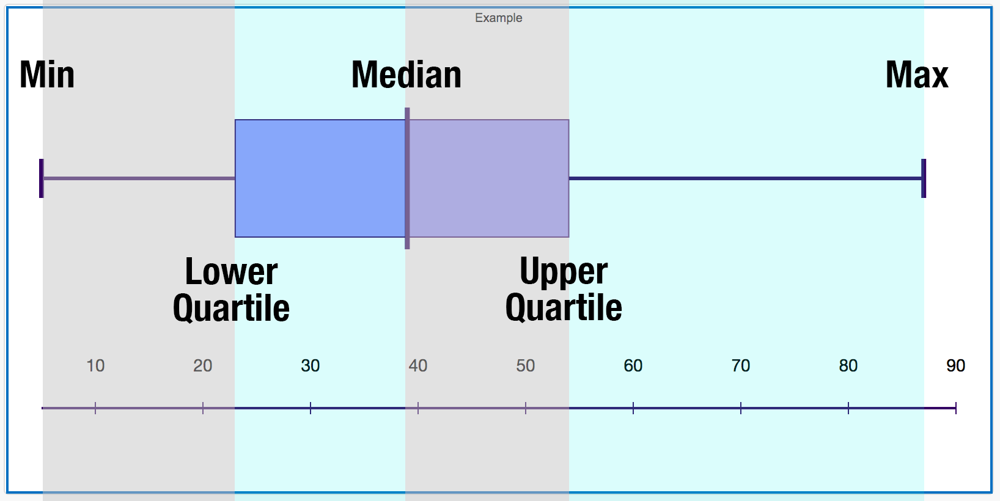

```{r setup, include=FALSE}
library(knitr)
knitr::opts_chunk$set(echo = FALSE, fig.align="center")
opts_knit$get("rmarkdown.pandoc.to")
html <- knitr::opts_knit$get("rmarkdown.pandoc.to") == "html"
```


```{r results='asis'}
if (!html) {
  cat("\\title{\\sessionnumber} \\subtitle{\\modulecode: \\moduletitle} \\frame{\\titlepage} ")
}

#############
## CENTER 
out_type = knitr::opts_knit$get("rmarkdown.pandoc.to")

centerImage = function(asset, scale = 0.6){
  
  perc <- scale * 100
  
  if(out_type == 'latex' || out_type == 'beamer')
    paste("\\begin{figure}\n \\includegraphics[width=", scale, "\\columnwidth]{", asset, "}\n \\end{figure}", sep="")
  else if(out_type == 'html')
    paste("<center>\n{ width=", perc, "% }\n</center>", sep="")
  else
    asset
}
```

## Register Attendance


## Quantitative Data vs Qualitative

Qualitative                   | Quantitative
----------------------------- | ------------------------
Slow                          | Fast
Subjective                    | Objective
Mostly Manual                 | Mostly automated
discover patterns             | Representation?
Causal Links                  | 

## Statistical Analysis

- More labor intensive than data collection
- Important to choose the appropriate methods
- This module is only converned with descriptive statistics

Side note: Understanding statistical analysis will help you to understand the validity of findings reported in other studies


## To err is human (Alexander Pope, "Essay on Criticism")

- Reasonableness 
- Fomatting
- Fix or removal (do not fudge!) 


## Preparation
- Grouping
- Organising - Some statistical tools require data to be presented in a specific way
- Formatting
- Coding
    + Yes or no answers could be coded as 1 or 0 accordingly
    + Example of complex codeing [Paper: Hu and Feng(2015)](https://dl.acm.org/citation.cfm?id=2729981)

## Descriptive Statistics
1. Central Tendency
2. Spread

# 1.Central Tendency
The central tendency is an attempt to identify where the majority of results are positioned. There are three main techniques for describing the central tendency: 

- Mean
- Median
- Mode

## The Bill Gates Effect (Mean vs. Median)

Bob, Pete, Dave and Baz are sitting at the bar. Don't judge, they are working class folk who like a beer thats all.

Name            | Salary
----------------| -------------
Bob             |    21k
Pete            |    27k
Dave            |    28k
Sam             |    29k
Baz             |    31k


## Mean
The mean of their salaries is (X-Bar represents the sample mean): 
$$\bar x = (\sum_ {}X{i}) / n$$
$$(21+27+28+29+31)/5 = 27.2k $$

## In Comes Bill Gates

And shoves poor old Bax off his chair. Baz panics and runs out of the building. Meanwhile, Bill Gates convinces the others they are better off for him being there. 

- How? 
- And why is this not true? 

## Let's Recalculate
Name            | Salary
----------------| -------------
Bob             |    21k
Pete            |    27k
Dave            |    28k
Sam             |    29k
Bill            |    1,000,000k

New Mean: (21 + 27 + 28 + 29 + 1000000) / 5 = 200k-ish (who cares, Bill Gates is already drunk!) 
The average salary has gone up and everyone is wealthier! 


## Median
It is the value that separates the lower half of the values from the upper half

The median is resistant to extreme data values meaning that it will not be skewed by Bill Gates

Original Median = ~~21~~, ~~27~~, 28, ~~29~~, ~~31~~

Bill Median = ~~21~~, ~~27~~, 28, ~~29~~, ~~1000000~~

## Mode 
The value that occurs most frequently. 

Unfortunately, there is no mode in the bar at the moment but if Bill leaves and Daves mate Jim appears who also earns 28k then the mode would be 28! 

- The mode is resistant to extreme data values
- useful for qualitative inspection
- Not capable of further mathematical treatment

## 2. Spread

The second objective in descriptive statistics is to describe how far the results deviate from the center. This is know as the spread. 

- Range
- Variance
- Standard Deviation
- Normal Distribution

## Range
- The range is the distance between the highest and lowest values. 
- The higher ther range the wider the distribution

Example: 
$$6, 8, 12, 34, 43, 43, 50, 55$$
$$ 55 - 5 = 49 $$
Therefore, the range is **49**


## Variance

> Variance is the, "mean of the squared distances of all the values from the mean of the data set"

(Lazar et al, 2017)

- Sigma^2^
- Describes how far a set of values are spread out from the mean

$$\sigma^2/s^2 = \frac{\displaystyle\sum_{i=1}^{n}(x_i - \bar x)^2} {n}$$

## Variance and Mean


## Normal Distribution



## Standard Deviation


$$ \sigma/s = \sqrt {\frac {\sum _{i=1}^{N}(x_{i}-{\overline {x}})^{2}}{N-1}} $$

## Statistical Tools
- Spreadsheets (Excel, Google Sheets)
- Statistical Package for the Social Sciences (SPSS) 
- R programming language and free software environment for statistical computing

## Box Plots


## Box Plots

- Box Plots are easy to generate using [ChemGrid's Boxplotr Tool](http://shiny.chemgrid.org/boxplotr/)

## QUICK BREAK
- Fresh Air
- Rehydrate
- Snack food for the brain?

## Qualitative Data Analysis
- Unstructured
- Complex
- Unpredictable 
- Subjective
- Time

## The Goal
- Convert unstructured data into meaning to describe a situation of phenomenon
- To be transparent about the process 
- Use proven methodolgy to ensure valid and reliable results

## Content Analysis
The process of reducing a piece of content down into a representative description based on rules of coding. The term, 'content', describes any qualitative data collected directly or indirectly from the particpants.

- Text
- Image
- Audio
- Video
- Photos

## Preparation
- Lock in scope
- Define your data set (exactly what is being taken into consideration)
- Clearly define the popluation 
- Remove any data that doesn't fit the criteria

## Coding 
> "involves assigning categories and descriptors to blocks"

(Lazar et al, 2017)

- Comparisons
- Deriving concepts
- Convert concepts into properties or dimensions

## Emergent Coding
- Conducted without guidance from existing theory of modeling
- Note down interesting concepts 
- Continually refine
- Good for new research
- See: Grounded Theory

## Priori Coding
- Draws upon established theories or existing models
- Categories are defined before analysis
- Based on solid theoretical framework (taxonomies)
- Good for research in well established areas
- Higher levels of rigour and validity
- Transparent and less vulnerable to bias

## Step-by-step Guide

[A Step-By-Step Guide To Qualitative Data Analysis - Nancy Gibson](https://www.researchgate.net/publication/292432218_A_Step-By-Step_Guide_To_Qualitative_Data_Analysis)

## Activities

1. Recruit three experts to carry out heuristic evaluations
2. Write methodology for report
3. Plan your study

