```{r setup, include=FALSE}
knitr::opts_chunk$set(echo = FALSE)
```

\title{\sessionnumber:  Immersion}
\subtitle{\modulecode: \moduletitle}

\frame{\titlepage} 

## Register Attendance


## Learning Outcomes 
After this session you will be able to:

- **Define** the term immersion
- **Design** mixed reality experiences with consideration for human-factors
- **Discuss** immersion using the correct vocabulary 

## Immersion
Immersion is the objective degree to which a VR system and application projects stimuli onto the sensory receptors. We discuss immersion in terms of:

- Extensiveness - Range of sensory modalities targeted 
- Matching - Stimuli vs reality
- Surrounding - Extent of environment (panoramic) and tracking
- Vividness - The quality of simulation
- Intractability - The quality of the input and outputs
- Plot - How compelling the narrative is

## 
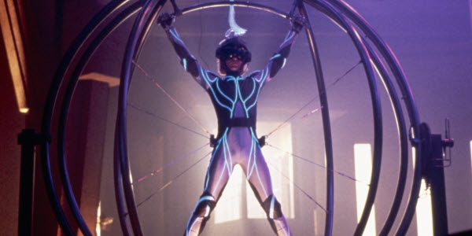
	
## Immersion vs. Presence
> "Presence is the psychological state of subjective perception in which even though part or all of an individual's current experience is generated by and/or filtered through human-made technology, part or all of the individual's perception fails to accurately acknowledge the role of the technology in the experience." 
	
- International Society for Presence Research, 2000
[ISPR Website](http://ispr.info)

Next Week: We will cover presence through the psychological state of subjective perception and illusions that help facilitate VR sytems.

## Perceptual Modalities}
> "A perceptual modality can be defined as the means through which information is extracted from the environment"

- James and Galbraith, 1985)
	
Immersion is created by surrounding the user of the VR system in images, sound or other stimuli that provide an engrossing total environment.
In order to achieve an illusion of immersion a reality system must consider the perceptual modalities: **sight**, **hearing**, touch, proprioception, **balance/motion**, smell and taste. 
	

## 
[ 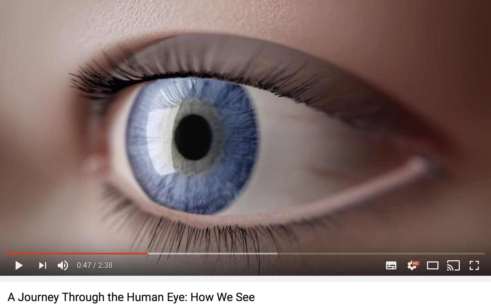 ](https://www.youtube.com/watch?v=gvozcv8pS3c)

##
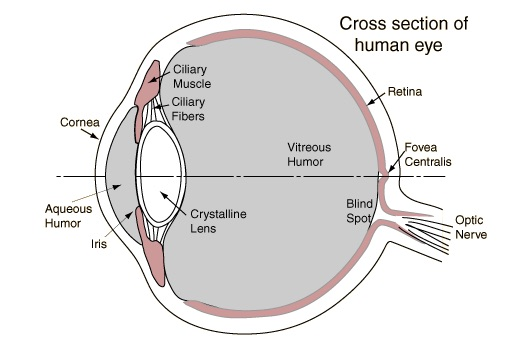
	
## Cones and Rods

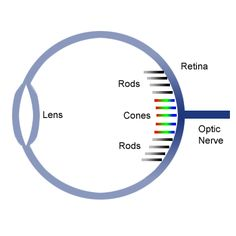
	
## Central vs. Peripheral Vision
**Central**
- has high visual acuity,
- optimised for bright daytime conditions, and
- item is color sensitive.
	
**Peripheral Vision**
- is color insensitive, 
- is more sensitive to light than central vision in dark conditions,
- is less sensitive to longer wavelengths (i.e., red),
- has faster response and has more sensitive to fast motion and flicker, and
- is less sensitive to slow motions.

[Interesting Activity](http://www.scientificamerican.com/article/put-your-peripheral-vision-to-the-test/)

## Field of View and Field of Regard

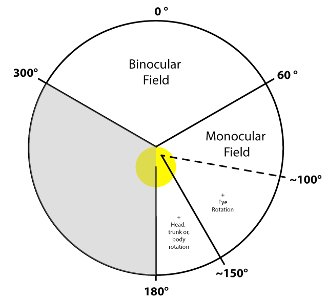


## Arc Seconds & Minutes


## Arc Seconds & Minutes
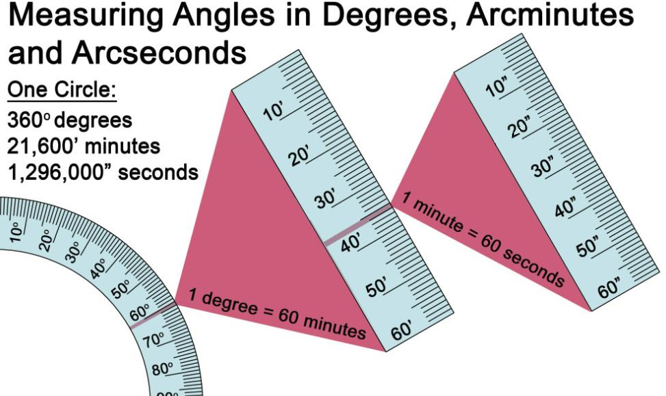

## Acuity
- Visual Acuity is the ability to resolve details and often measured in visual angle.
- A fifty pence coin held at arms length has an angle of acuity of 2$^\circ$
- A fifty pence coin held up at 81 meters away has an angle of acuity of one arc min(1/60th of a degree). 
- In perfect conditions a human can see a line as thin as 0.5 are sec(1/7200th of a degree). 

## 
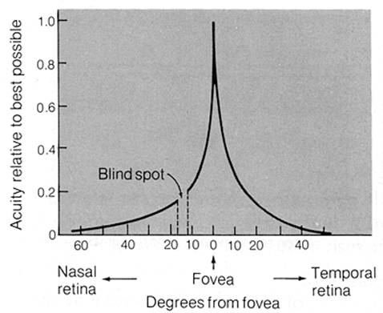

##
The evidence suggests that given stereoscopic vision with each eye able to see 210$^\circ$ (including rotation) a display would need horizontal vision of 378,000 pixels for each eye to match what we see in reality. 

$210 * 60 * (60/2) = 378,000$
	
Obviously, this is an extreme analysis and there are ways that we can work around these limitations. 

## Foveated Rendering
[ 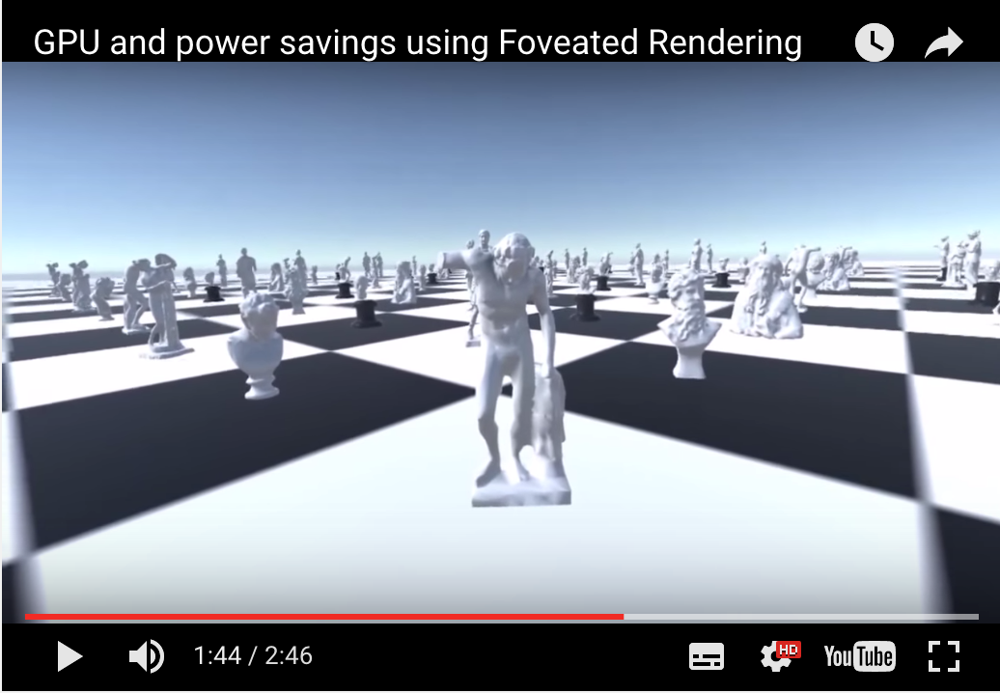 ](https://www.youtube.com/watch?v=6q3w0fiD0zg)

## VR Lenses
[  ](https://www.youtube.com/watch?v=NCBEYaC876A) 

## Chromatic Aberration 
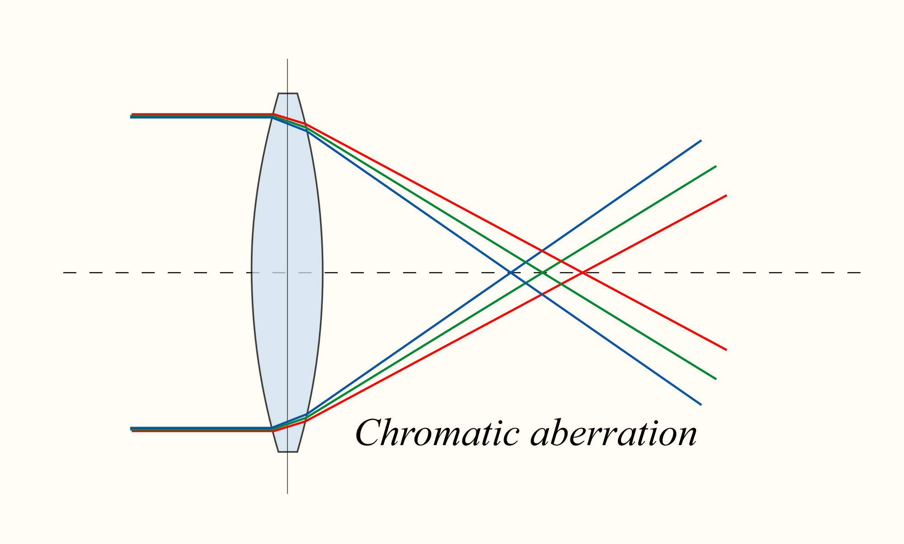	\includegraphics[scale=.1]{assets/aberration} 

##
> "After long session, I still have an hangover time though, as if I was on drugs the whole time and I need to readjust to reality."
	
[link to further discussion](https://www.reddit.com/r/oculus/comments/2clksh/question_for_dk2_owners_how_long_can_you_wear_it/cjgo683) {[link to further discussion]} 
[and more](https://www.reddit.com/r/oculus/comments/2epu1h/my_body_has_developed_a_fear_of_vr/)
	
## Vergence-Accommodation Conflict
	
**Vergence** - How your eyes track an object coming towards you. 

**Accommodation** - When you pupils adjust to the objects light field. 
	
The two actions are hardwired to work in sync as they are both trying aid the same process of tracking an object. They can be decoupled but it is not a comfortable experience for the user.

##
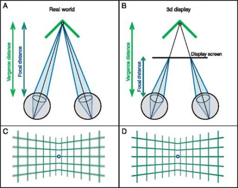

## Motion to Photon Latency

- **Motion** - refers to the users movements in the physical space.
- **Photons** - The photons emitted from the HMD that are absorbed by photoreceptors (cones & rods) on the retina.
- **Latency** - delay between the two. 

Put simply, motion to photon latency is the time it takes for the users movements in physical space to be visualised on the head-mounted display(HMD).
	
## Side Effects
The 20ms motion-to-photon latency gold standard
	
When the motion to photon latency is greater than 20ms or anytime there is inconsistent stimuli between the players physical body motions and the visuals displayed in the head-mounted display (HMD) then there is a good chance that motion sickness/simulator sickness will occur.

According to the Oculus Rift docs, other factors that can contribute to simulator sickness are:

##
- Acceleration - minimize the size and frequency of accelerations
- Degree of control - don't take control away from the user
- Duration of simulator use - allow and encourage users to take breaks
- Altitude - avoid filling the field of view with the ground
- Binocular disparity - some find viewing stereoscopic images uncomfortable
- Field-of-View - reducing the amount of visual field covered by the virtual environment may also reduce comfort
- ... (the list goes on)


## Oculus Rift Health \& Safety Guide
[ 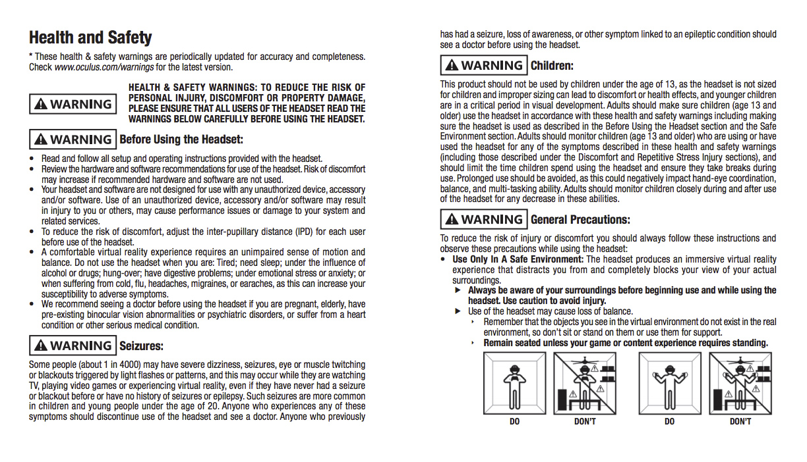 ](https://static.oculus.com/documents/310-30023-01_Rift_HealthSafety_English.pdf)

## Sound
	
Sound is a pressure wave in a material medium (air or water for example) created when an object vibrates back and forth. The frequency of the sound is dependant on the number of full oscillations that occur during one second. 

**Humans can hear frequencies from roughly 20 to 22,000Hz but are most comfortable with frequencies of 2,000 - 4000Hz, Why?** \pause

Most useful for speech recognition!

## Perceived Sound
Sound enters the ear vibrating the ear drum, these vibrations are picked up by receptor cells that transduce(electrical signal) those vibrations into a signal to be interpreted by the brain. The brain processes the signal in order to identify qualities such as loudness, pitch and timbre. 
	
**What is timber?** \pause
The character or quality of a musical sound or voice as distinct from its pitch and intensity.

## Binaural Sound
> "Binaural recording means constructing an accurate artificial head, and placing microphones in the position of the eardrums. The resulting audio accurately records the effect of the sound travelling through the skull and ears, resulting in incredibly accurate positional sound that can be played back through any standard stereo headphones."

> "Although it is a challenging technical task this can be simulated digitally, resulting in a a more immersive experience for all headphone wearing players, but of huge benefit for players with impaired vision, allowing accurate enough spatial awareness to navigate 3D environments via standard stereo headphones."

[Game Accessibility Guidelines](http://gameaccessibilityguidelines.com/)

## Head Related Transfer Functions (HRTF) and Occlusion
> "HRTFs work by filtering an audio signal to recreate the complex cues that help us, as humans, localise sounds. The cues are influenced by multiple factors, including the listening environment and the shape of your body, head and ears. In reality, we move our heads and reorient ourselves to localise sounds. We constantly try to bring sounds (or the objects that are creating such sounds) into our line of sight to overcome the ambiguity of spatialisation."

> "Occlusion is the next step up from this in that it can indirectly reflect the sound off walls."

- [Unity Manual](https://docs.unity3d.com/Manual/AudioSpatializerSDK.html)


## Balance
There are three systems at work to aid in balance:
	
- Vestibular System (motion, equilibrium, spatial orientation)
- Proprioception (position, motion, and equilibrium)
- Vision (sight)

## Vestibular System
[ 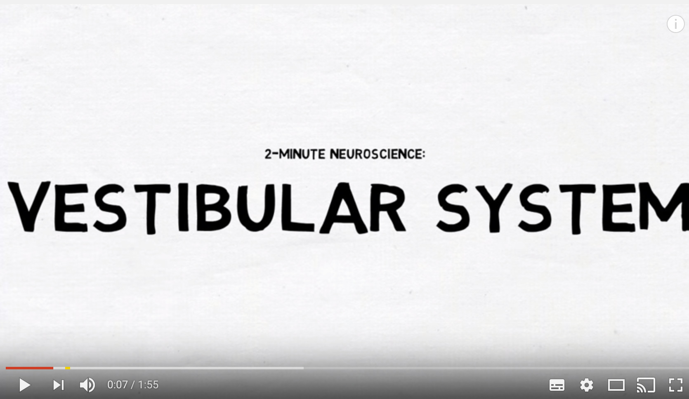 ](https://www.youtube.com/watch?v=P3aYqxGesqs)
	

## Vestibular System - Issues
- Visually induced motion sickness (VIMS) is a specific type of motion sickness caused by a conflict between vision and both the proprioception and vestibular systems.
- According to Forbes, when a player is cycling a bike in VR, they have a tendency to lean to accommodate for corning, and as a consequence they fall off.
- When tradition big screens cause VIMS the viewer can just look away but in VR this is not possible. 
	

