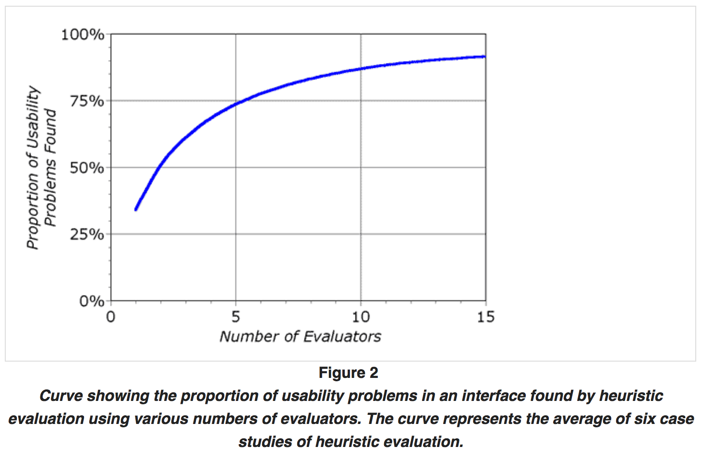
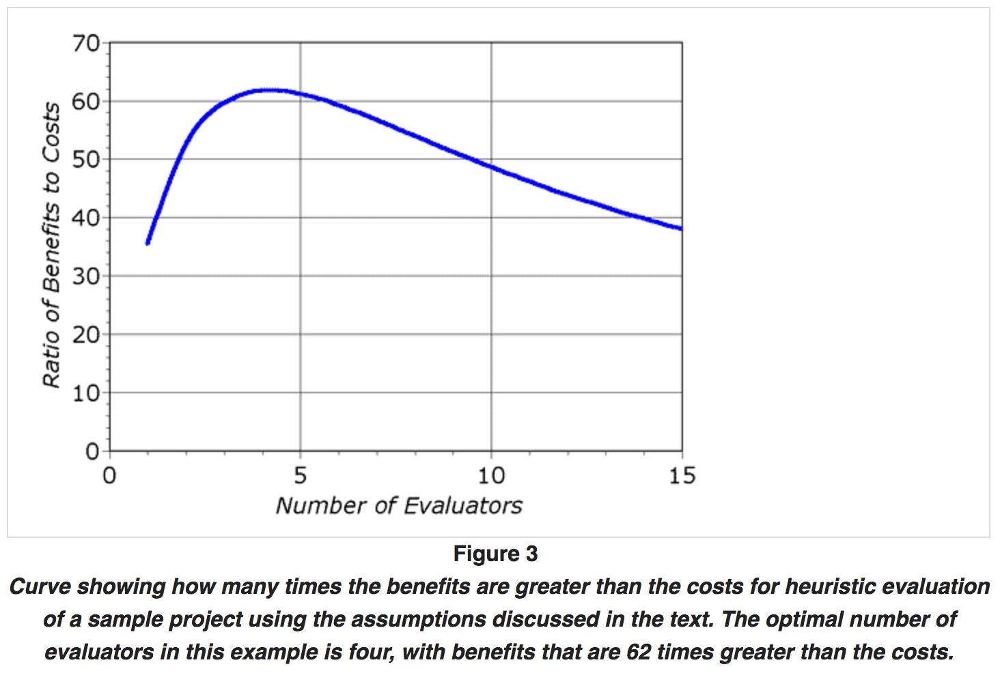

```{r setup, include=FALSE}
knitr::opts_chunk$set(echo = FALSE)
```
\title{\sessionnumber: Heuristic Evaluation}
\subtitle{\modulecode: \moduletitle}

\frame{\titlepage} 

# Session 3: Useability Testing with a focus on Heuristic Evaluation

## Register Attendance


## Learning Outcomes {.build}
After this session you will be able to:

- **Describe** the difference between expert, automated & user testing.
- **Justify** the choice of heuristics for various situations.
- **Implement** a heuristic evaluation.

## Types of Usability Testing
According to Lazar et al., there are three different types of usability testing:
- Expert (today)
- Automated
- User

## User Testing
"groups of representative users attempting a set of
representative tasks." The results should feed back into the
design of the interface.
 
- Should happen throughout the entire design and development cycle and it is always easier to start earlier than later.
- Allows you to test assumptions about the user early.
- May produce negative results, do not take them
personally.

## Automated
"An automated usability test is a software application that inspects a series of interfaces to assess the level of
usability. Often, this works by using a set of interface guidelines and having the software compare the guidelines to the interface." [^1]

- They can be executed very quickly and often generate reports.
- They can detect a limited amount of issues.
- Focus on quantitative data such as the number of different fonts and sizes used, or depths of menu layers.

[^1]: [Melody Y. Ivory and Marti A Hearst. 2001. The state of the art in automating usability evaluation of
user interfaces. ACM Comput. Surv. 33, 4 (December 2001), 470-516.](http://dx.doi.org.ezproxy.falmouth.ac.uk/10.1145/503112.503114)


## Expert Based (TODAY)
"Expert-based tests are essentially structured inspections by interface experts."

Expert Inspection

- To avoid bias, the expert should not have any involvement in the design and development of the interface.
- Can often be carried out without a deep understanding of in the interface.
- Expert testing can be used in conjunction with user testing but must be done first.

## Types of Expert-Based Usability Testing
- Consistency Inspection
- Cognitive Walk-Through
- Heuristic Evaluation
- Most tests that draw upon expert experience to derive insight.

## According to Wikipedia:

> “A heuristic technique, often called simply a heuristic, is any approach to problem solving, learning, or discovery that employs a practical method not guaranteed to be optimal or perfect, but sufficient for the immediate goals.” 

– Wikipedia


## What Does NNG Say?
> "Heuristic evaluation involves having a small set of evaluators examine the interface and judge its compliance with recognised usability  principles (the 'heuristics')."

[Link](https://www.nngroup.com/articles/how-to-conduct-a-heuristic-evaluation/)

## Basic Steps
1. **Training -** Provide expert with the domain specific knowledge needed for a given test scenario
2. **Execute -** Experts carry out evaluation (two passes minimum) in isolation of other experts but usually with one or more observers (‘experimenter’).
3. **Assess -** Expert assigns a severity rating to each issue found.
4. **Debrief -** Short debrief to discuss the findings with the relevant stakeholders (usually the other experts and the design team).

## When?
> "Since the evaluators are not using the system as such (to perform a real task), it is possible to perform heuristic evaluation of user interfaces that exist on paper only and have not yet been implemented (Nielsen 1990). This makes heuristic evaluation suited for use early in the usability engineering lifecycle."

(Nielsen, 1995)

## Sample Size

How many experts should evaluate an interface?



## Cost VS. Benefits




## Issues
we are looking for issues in located in a dialogue in four different ways:

1. at a single location in the interface
2. at two or more locations that have to be compared to find the problem
3. as a problem with the overall structure of the interface,
4. and finally as something that ought to be included in the interface but is currently missing. 

[- Source](https://www.nngroup.com/articles/usability-problems-found-by-heuristic-evaluation/) 

42% likely to identify major issues vs. 32% chance of spotting minor issues (Nielsen 1992).

## Strengths
- It can provide some quick and relatively inexpensive feedback to designers.
- You can obtain feedback early in the design process.
- Assigning the correct heuristic can help suggest the best corrective measures to designers.
- You can use it together with other usability testing methodologies.
- You can conduct usability testing to further examine potential issues.

## Weaknesses
- It requires knowledge and experience to apply the heuristics effectively.
- Trained usability experts are sometimes hard to find and can be expensive.
- You should use multiple experts and aggregate their results.
- The evaluation may identify more minor issues and fewer major issues.


# Jacob Nielsens Original Heuristics (Revised)

## Visibility of system status
The system should always keep users informed about what is going on, through appropriate feedback within reasonable time.

[(Read full article on visibility of system status.)](https://www.nngroup.com/articles/visibility-system-status/)

## Match between system and the real world
The system should speak the users' language, with words, phrases and concepts familiar to the user, rather than system-oriented terms. Follow real-world conventions, making information appear in a natural and logical order.

[(Read full article on the match between the system and the real world.)](https://www.nngroup.com/articles/match-system-real-world/)

## User control and freedom
Users often choose system functions by mistake and will need a clearly marked "emergency exit" to leave the unwanted state without having to go through an extended dialogue. Support undo and redo.

## Consistency and standards
Users should not have to wonder whether different words, situations, or actions mean the same thing. Follow platform conventions.
[Follow: ](https://www.nngroup.com/articles/do-interface-standards-stifle-design-creativity/)

## Error prevention
Even better than good error messages is a careful design which prevents a problem from occurring in the first place. Either eliminate error-prone conditions or check for them and present users with a confirmation option before they commit to the action.

[(Read full article on preventing user errors.)](https://www.nngroup.com/articles/slips/)

## Recognition rather than recall
Minimize the user's memory load by making objects, actions, and options visible. The user should not have to remember information from one part of the dialogue to another. Instructions for use of the system should be visible or easily retrievable whenever appropriate.

[(Read full article on recognition vs. recall in UX.)](https://www.nngroup.com/articles/recognition-and-recall/)

## Flexibility and efficiency of use
Accelerators — unseen by the novice user — may often speed up the interaction for the expert user such that the system can cater to both inexperienced and experienced users. Allow users to tailor frequent actions.

## Aesthetic and minimalist design
Dialogues should not contain information which is irrelevant or rarely needed. Every extra unit of information in a dialogue competes with the relevant units of information and diminishes their relative visibility.

## Help users recognize, diagnose, and recover from errors
Error messages should be expressed in plain language (no codes), precisely indicate the problem, and constructively suggest a solution.

## Help and documentation
Even though it is better if the system can be used without documentation, it may be necessary to provide help and documentation. Any such information should be easy to search, focused on the user's task, list concrete steps to be carried out, and not be too large.

## Alternatives
- [Heuristic Evaluation for Playability (HEP)](https://www.researchgate.net/publication/200553251_Using_heuristics_to_evaluate_the_playability_of_games)
- [Heuristic evaluation of virtual reality applications](https://www.researchgate.net/publication/222086342_Heuristic_evaluation_of_virtual_reality_applications)
- [Usability Principles for Video Game Design](http://citeseerx.ist.psu.edu/viewdoc/download?doi=10.1.1.142.211&rep=rep1&type=pdf)
- [Augmented Reality Design Heuristics: DESIGNING FOR
DYNAMIC INTERACTIONS](http://journals.sagepub.com/doi/pdf/10.1177/1541931213602007)
- and many more!
