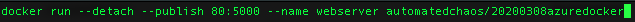

```{r setup, include=FALSE}
library(knitr)
knitr::opts_chunk$set(echo = FALSE, fig.align="center")
opts_knit$get("rmarkdown.pandoc.to")
html <- knitr::opts_knit$get("rmarkdown.pandoc.to") == "html"
```


```{r results='asis'}
if (!html) {
  cat("\\title{\\sessionnumber} \\subtitle{\\modulecode: \\moduletitle} \\frame{\\titlepage} ")
}

#############
## CENTER 
out_type = knitr::opts_knit$get("rmarkdown.pandoc.to")

centerImage = function(asset, scale = 0.6){
  
  perc <- scale * 100
  
  if(out_type == 'latex' || out_type == 'beamer')
    paste("\\begin{figure}\n \\includegraphics[width=", scale, "\\columnwidth]{", asset, "}\n \\end{figure}", sep="")
  else if(out_type == 'html')
    paste("<center>\n{ width=", perc, "% }\n</center>", sep="")
  else
    asset
}
```

## Register Attendance


## What are containers? 


## One Definition

>"A software container provides a standard packaging and distribution format that is generic and widespread, enabling greatly increased carrying capacity, lower costs, economies of scale and ease of handling." 

(Arundel & Domingus - 2019)

--- 

>"The container format contains everything the application needs to run, baked into an image file that can be executed by a container runtime (Docker in our case)."

(Arundel & Domingus - 2019)

## Simply put...

Package Software into Standardized Units for Development, Shipment and Deployment

## Docker vs. Virtual Machines


## Some more info

Virual Machines               | Containers
----------------------------- | ------------------------
2GB+                          | 10-150MB
Full operating System         | Shares host kernel
Contains irrelevant files     | Only required files 
Emulated CPU                  | Run on host CPU
upto 30% slower               | Runs like binary executable

## Docker


## Architecture


## Images
>"An image is a read-only template with instructions for creating a Docker container." - Docker Docs

- Create an images using YAML inside a 'Dockerfile'
- The YAML provides instructions for how to 'build' the image
- Instructions create layers
- Only layers that change need to be rebuilt


## Containers

>"A container is a runnable instance of an image" - Docker Docs

- Verbs: create, start, stop, move, or delete
- Managed using the Docker CLI or API
- Isolated from other containers by default
- You control how network, storage and subsystem are 

## Services

>"Services allow you to scale containers across multiple Docker daemons, which all work together as a swarm with multiple managers and workers." - Docker Docs

## Dockerfile


## Commands - build


`-t` tag the image with a name and version

**DON'T MISS THE DOT AT THE END**


## Commands - run



`--publish` forward incoming traffic on the host’s port 80, to the container’s port 5000

`--detach` run this container in the background

`--name` the name with which you can refer to your container in subsequent command

## Commands - rm (remove)


## Docker Registry

> "The Registry is a stateless, highly scalable server side application that stores and lets you distribute Docker images." Docker Docs

- Open source
- Free Docker Hub
- push and pull

## Push in three steps...
**STEP 1: Log in with CLI**

`docker login --username=yourhubusername --email=youremail@company.com`

**STEP 2: Tag your image**

`docker tag [IMAGE ID] yourhubusername/webserver:1.0`

**STEP 3: Push**

`docker push yourhubusername/webserver:1.0`


# DEMO TIME

