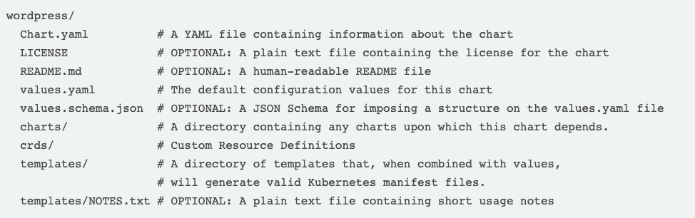

```{r setup, include=FALSE}
library(knitr)
knitr::opts_chunk$set(echo = FALSE, fig.align="center")
opts_knit$get("rmarkdown.pandoc.to")
html <- knitr::opts_knit$get("rmarkdown.pandoc.to") == "html"
```


```{r results='asis'}
if (!html) {
  cat("\\title{\\sessionnumber} \\subtitle{\\modulecode: \\moduletitle} \\frame{\\titlepage} ")
}

#############
## CENTER 
out_type = knitr::opts_knit$get("rmarkdown.pandoc.to")

centerImage = function(asset, scale = 0.6){
  
  perc <- scale * 100
  
  if(out_type == 'latex' || out_type == 'beamer')
    paste("\\begin{figure}\n \\includegraphics[width=", scale, "\\columnwidth]{", asset, "}\n \\end{figure}", sep="")
  else if(out_type == 'html')
    paste("<center>\n{ width=", perc, "% }\n</center>", sep="")
  else
    asset
}
```

## Register Attendance


## Kubernetes 

> "Kubernetes is the operating system of the cloud native world, providing a reliable and scalable platform for running containerised workloads." (Arundel, Domingus, 2019)

`r centerImage("assets/kubernetes-logo.png", .3)`

## Kubernetes

- Extremely popluar
- Connects many servers together (orchestration)
- There are managed versions of Kubernetes (good for most options)
- Can be quite difficult to get right
- Avoid vendor lock-in

## Architecture - Cluster

"A Kubernetes cluster is a set of node machines for running containerized applications." (RedHat, 2019) 

- Contains a worker node and a master node."
- Comprise of multiple nodes 
- Nodes are basically just individual machines

## Architecture - Master Node

- Control Plane (the brain of the cluster)
- Stores info about all **worker nodes** 
- Multiple instances - highly available
- Manages **deployments**
- Doesn't **usually** run user workloads 
- failure might cause eratic behavior 

## Architecture - Worker Nodes

- manages the container runtime (Docker)
- User workloads 
- failure is acceptable 

## Fundamentals - Deployments

"For every program that Kubernetes has to supervise, it creates a corresponding Deployment object, which records some information about the program: the name of the container image, the number of replicas you want to run, and whatever else it needs to know to start the container." 

(Arundel, Domingus, 2019)

- Supervising and scheduling
- The **Deployment Controller** maintains the desired spec
- Restart always by default
- Restart only on failure

`kubectl get deployments`

## Fundamentals - Pods 

"A **Pod** is the Kubernetes object that represents a group of one or more containers" 

(Arundel, Domingus, 2019)

- Most Pods have one container
- dependant container should scheduled together and thus live in the same Pod
- Defined via Pod Specification 
- When a deployment decides a new replica is needed, it creates a Pod resource in the Kubernetes database and the Pod is added to a queue for the Scheduler to handle 

## Fundamentals - Services 

Services solve a fundamental issue by providing a single, unchanging IP address or DNS name to route traffic to the appropriate Pods. 

- Think of a service as a web proxy of load balancer
- forwards requests to backend Pods
- Any ports not just web (80, 443)
 
## Cluster Overview

`r centerImage("assets/cluster.png", .8)`

## Kubectl 

Multipurpose tool for: 

- Applying configurations 
- Creating, deleting and modifying resources 
- Querying the state of the Cluster

examples: 

- `kubectl get nodes`
- `kubectl describe`

## Helm Package Manager

`r centerImage("assets/helm.png")`

## Helm Package Manager

- Part of the Cloud Native Computing Foundation (CNCF) family
- Widespread
- Command line interface (CLI)
- **Helm Charts** contains resource definitions required to run app
- **Release** a particular instance of a chart running on a cluster
- **Helm repository** to host and share charts
- Charts are often stored in the application repo

## Helm Charts

- Can be installed multiple times in the same cluster
- Each Helm Chart release has a unique name (-name flag)
- `helm list` output current releases
- `helm status [release name]` provides details about status of specific release
- Streamline the process of installing applications

## Helm Chart Structure

`helm create helm-chart`



## Activity: Kubernetes Bootcamp

`r centerImage("assets/bootcamp.png", .8)`

[* Official Kubernetes Interactive Tutorials](https://kubernetes.io/docs/tutorials/kubernetes-basics/)