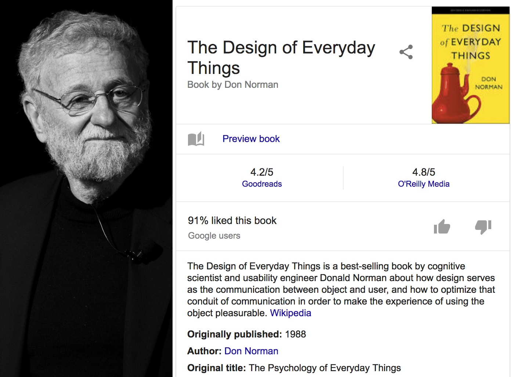
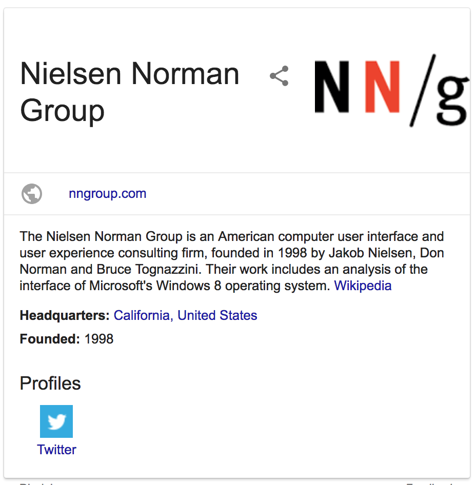

```{r setup, include=FALSE}
library(knitr)
knitr::opts_chunk$set(echo = FALSE, fig.align="center")
opts_knit$get("rmarkdown.pandoc.to")
html <- knitr::opts_knit$get("rmarkdown.pandoc.to") == "html"
```


```{r results='asis'}
if (!html) {
  cat("\\title{\\sessionnumber: An Introduction to HCI} \\subtitle{\\modulecode: \\moduletitle} \\frame{\\titlepage} ")
}
```

## Register Attendance


## Learning Outcomes 
After this session you will be able to:

- **Explain** what is meant by the term human-computer interaction (HCI)
- **Discuss** how HCI has changed over the years
- **Outline** some basic HCI principles as described by Don Norman in his book, The Design of Everyday Things  

## Human-Computer Interaction (HCI)
> "If we didn't have people, everything would work so much better" - **Donald A. Norman**

## HCI is.. 

the study of the relationship between people and technology

```{r results='asis'}
if (html) {
  cat('<iframe width="640" height="390" src="https://www.youtube.com/embed/C_OnYqx3ynA?feature=player_detailpage" frameborder="0" allowfullscreen></iframe>')
}else{
  cat("  ](assets/cyborgist.jpg){ width=30% }")
}
```
		
## A Little Bit of History
	
- Commonly understood that HCI formally acknowledged as a field of study in 1982
- driven by the shift from secure cool room computers to personal computer - Apple 2 IBM PC Commodore
- In essence, non-engineers having access to computers
- Early computers were pretty daunting to non-engineers
- HCI was born from the shift from specialist users to day-to-day use by non-engineers
	
## Ivan Sutherland}

```{r results='asis'}
if (html) {
  cat('<iframe width="640" height="390" src="https://www.youtube.com/embed/6orsmFndx_o?t=655&feature=player_detailpage" frameborder="0" allowfullscreen></iframe>')
}else{
  cat(" ](assets/sutherland.png)")
}
```

	
## More recently...

Early 90s HCI blew up as the internet and web went mainstream and there was an explosion of new interface and communication methods

**Other Notable Shifts:**
	
- Fixed computers 2004 -  portable devices
- Authored content 2004 - user generated content
- personal portable screens - wearables and HMDs


## Tech Buzzword Bingo!

- Mobile
- Multitouch
- Gestures and natural computing
- Sensors
- Embedded
- Wearables
- Sustainability
- Big Data
- Social computing
- Accessibility
- Mixed Reality

## -
Lets begin with the principle that all artificial things are designed. 
	
Who is doing the designing?
	
# Are you doing any design? 

## HCI - A Crash Course}

Generally, HCI research is empirical. 


> "Relying on or derived from observation of experiment" - American Heritage Dictionary

## **Do not...** 

- Presume prior knowledge of the audience
- Especially, if they are a similar demographic to you
- Expect people to read the instructions
- Blame the user for errors
- Get frustrated with the user for unpredictable behaviour

## HCI is complex because...

- Borrow methods from other fields
- Create standards derived from other fields
- Involves Humans

# If HCI is the study of the relationship between people and technology what fields might that span?

## - 

- Computer Science (duh)
- Sociology
- Psychology
- Communication
- Human factors engineering
- Industrial engineering
- rehabilitation engineering
- and many more.

## HCI Research

> "HCI research requires both rigorous methods and relevance" **Donald A. Norman** 

We use it to influence interface design, development process, user training, and public policy. 
Generally, to improve our relationship with computers.

## What can be considered HCI contributions?

- Empirical
- Artefact
- Methodological
- Dataset
- Survey	
- Opinion
- theoretical

[Source](http://interactions.acm.org/archive/view/may-june-2016/research-contribution-in-human-computer-interaction)


## These are Exciting Times

- Tools are much better now
- Eye tracking, sensors (EMG EEG)
- Access to the masses - mechanical Turk, social networks, large amounts of generated content to analyse
- Automation - AI machine learning, neural networks

## Donald Norman

{ width=50% }

# Affordances

- Standard Affordances
- Perceivable Affordances
- Anti-Affordances

# Signifiers
	
# Mappings

# Mental models

## [Nielsen Norman Group](https://www.nngroup.com/)

{ width=50% }

