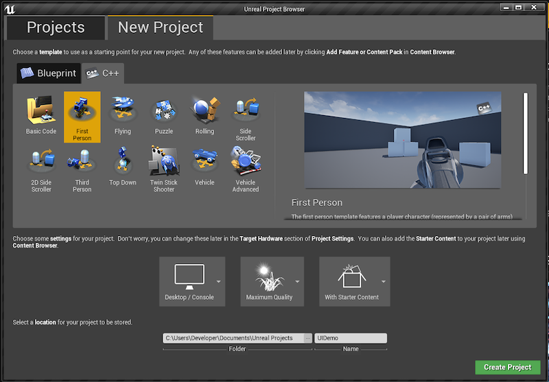
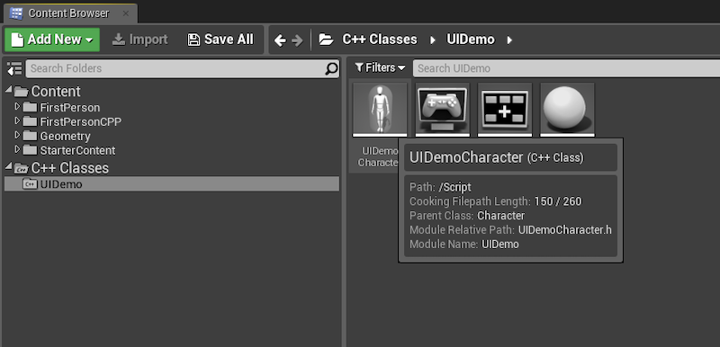
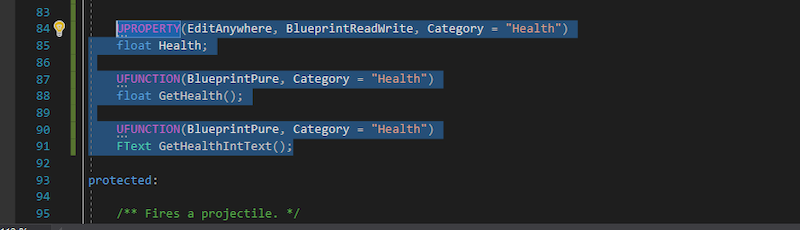
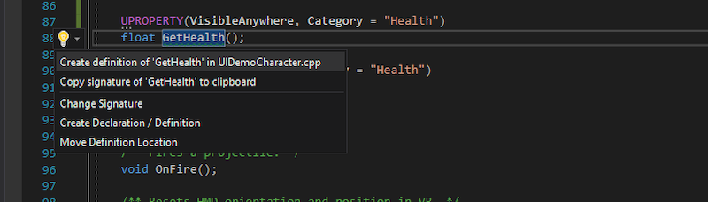
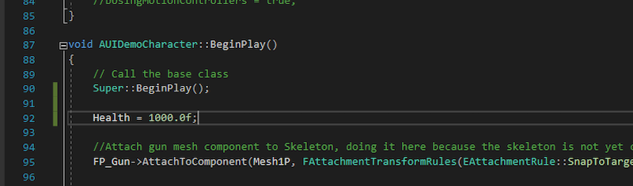
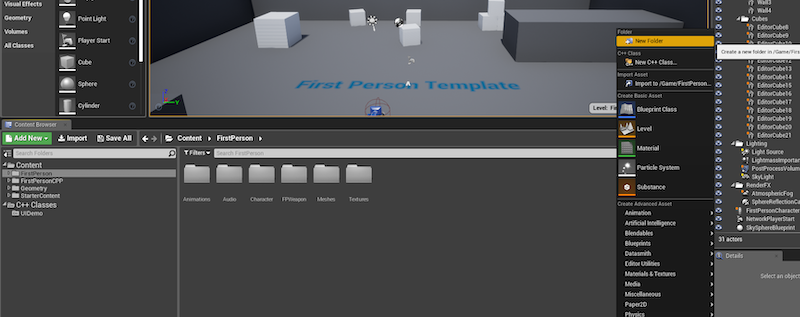
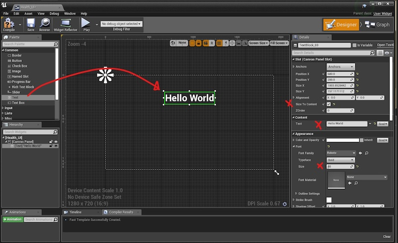
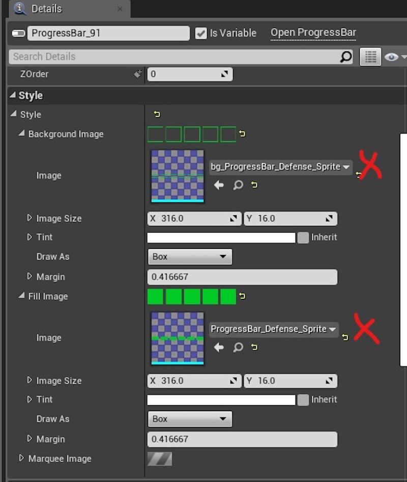
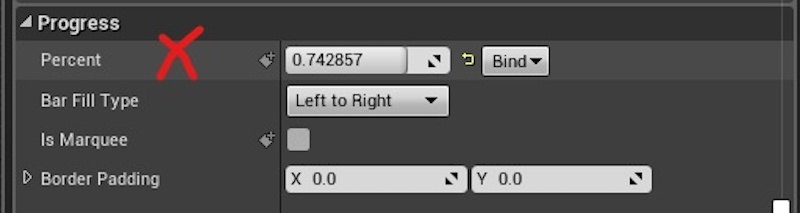

```{r setup, include=FALSE}
library(knitr)
knitr::opts_chunk$set(echo = FALSE, fig.align="center")
opts_knit$get("rmarkdown.pandoc.to")
html <- knitr::opts_knit$get("rmarkdown.pandoc.to") == "html"
mycounter <- 0

```


```{r results='asis'}
if (!html) {
  cat("\\title{\\sessionnumber: An Introduction to HCI} \\subtitle{\\modulecode: \\moduletitle} \\frame{\\titlepage} ")
}
```

## Register Attendance


## Learning Outcomes 
After completing this worksheet you will be able to:

- **Create** new Widget Blueprints
- **Design** UI using the Unreal Engine UMG Editor
- **Connect** a progress bar widget to a c++ variable  

*Using Unreal Engine 4.22.3

The only files you will need to complete this tutorial are the health bar background and fill:


## Warning

Because this tutorial uses the c++ FPS starter template. Unreal generates a lot of useful files for us and names them based on what we called the project. For this reason, the name of the files in the tutorial might ne named differently. This tutorial uses a generic file name so where the file in question might be called UIDemoCharacter.cpp it will be referred to as the Character .cpp. This allows for the abiguity when it comes to how you named the project.

# PART 1 - SETUP

## `r mycounter<-mycounter+1; mycounter`. Create Project

- Launch Unreal
- Select 'New Project' tab
- Select 'C++' on the secondary tab panel
- Then choose 'First Person' and name the project UI Demo. 



## `r mycounter<-mycounter+1; mycounter`. Modify Character
- Open the character class header file in Visual Studio
- Add the code below at the bottom of the public section and just above the protected section



```{c++}
UPROPERTY(EditAnywhere, BlueprintReadWrite, Category = "Health")
float Health;

UFUNCTION(BlueprintPure, Category = "Health")
float GetHealth();
	
UFUNCTION(BlueprintPure, Category = "Health")
FText GetHealthIntText();
```

## `r mycounter<-mycounter+1; mycounter`. It should look like this:




## `r mycounter<-mycounter+1; mycounter`. Generate methods for Character .cpp

add the new methods to the .cpp using the quick actions shortcut: 

- Right click on the method declaration
- Select 'Quick Actions and refactorings...'
- Select Create definition of <method> (see image below)



## `r mycounter<-mycounter+1; mycounter`. Populate Character .cpp 

Open up the Character .cpp and in the BeginPlay method set the health
```
Health = 1000.0f;
```

It should look like this: 



## `r mycounter<-mycounter+1; mycounter`. Popluate the get methods in Character .cpp
Now populate the auto generated methods: GetHealth and GetHealthIntText

```{c++}
float AUIDemoCharacter::GetHealth()
{
	return Health / 1000;
}

FText AUIDemoCharacter::GetHealthIntText()
{
	int32 HP = FMath::RoundHalfFromZero(Health / 100);
	FString HPS = FString::FromInt(HP);
	FString HealthHUD = HPS + FString(TEXT("%"));
	FText HPText = FText::FromString(HealthHUD);
	return HPText;
}
```

## `r mycounter<-mycounter+1; mycounter`. C++ DONE (for now)

- Lets get back into engine...
- Compile your project to make sure there are no mistakes


## `r mycounter<-mycounter+1; mycounter`. Folder Structure

- In the content browser, navigate to 'Content' -> 'FirstPerson'
- Create a new folder called 'UI' by right clicking on the right panel and selecting: 'New Folder'



## `r mycounter<-mycounter+1; mycounter`. Your folder structure should look like this: 


## `r mycounter<-mycounter+1; mycounter`. Create a new 'Widget Blueprint'

- Open the new 'UI' folder
- Right click on the empty panel and select 'User Interface' -> 'Widget Blueprint'
- Name the blueprint 'Health_UI'. Tip: spelling is important as we will refer back to this later in out code. 


## `r mycounter<-mycounter+1; mycounter`. Open the UMG UI Designer
- Double click on the new 'Health_UI' widget blueprint


## `r mycounter<-mycounter+1; mycounter`. UMG Hello world :) 

- Drag a Text Widget from the palette on the right hand side onto the canvas in the middle
- Update the details so that they match below



## `r mycounter<-mycounter+1; mycounter`. Get this to display (C++)

Before we can start manipulating UI in c++ we need to add some resources to the projects build.cs

- In Visual Studio, open the file <project-name>.build.cs
- Add the resource below to the 'PublicDependancyModuleNames' list:

``` "UMG", "Slate", "SlateCore" ```

It should now look like this:


## `r mycounter<-mycounter+1; mycounter`. Edit HUD .h file

- Open the HUD class in Visual Studio (remember this could be called something else depending on what you called your project)


## `r mycounter<-mycounter+1; mycounter`. HUD header file

Update the public and private sections to look like this: 

```
public: 
  AUIDemoHUD();
	
	/** Primary draw call for the HUD */
	virtual void DrawHUD() override;
	virtual void BeginPlay() override;  // new

private:
	/** Crosshair asset pointer */
	class UTexture2D* CrosshairTex;
	
	// new
	UPROPERTY(EditAnywhere, Category = "Health")
	TSubclassOf<class UUserWidget> HUDWidgetClass;
	
	// new
	UPROPERTY(EditAnywhere, Category = "Health")
	class UUserWidget* CurrentWidget;
};

```

## `r mycounter<-mycounter+1; mycounter`. Populate HUD .cpp file

- autogenerate the BeginPlay method the same as we did in step [TODO: NUMBER]
- Open the HUD .cpp file
- add UserWidgets to the includes at the top: 

``` #include "Blueprint/UserWidget.h" ```

- Add the code below to the constructor of the HUD .cpp file

```
  static ConstructorHelpers::FClassFinder<UUserWidget> HealthBarObj(TEXT("/Game/FirstPerson/UI/Health_UI"));
	HUDWidgetClass = HealthBarObj.Class;
```

## `r mycounter<-mycounter+1; mycounter`. The constructor should now look like this: 


## `r mycounter<-mycounter+1; mycounter`. Populate the BeginPlay Method

Now add this code below to the BeginPlay method

```
  Super::BeginPlay();
  
	if (HUDWidgetClass != nullptr) {
		CurrentWidget = CreateWidget<UUserWidget>(GetWorld(), HUDWidgetClass);
		if (CurrentWidget) {
			CurrentWidget->AddToViewport();
		}
	}
```

## `r mycounter<-mycounter+1; mycounter`. The beginPlay method should now look like this:


## `r mycounter<-mycounter+1; mycounter`. Test the HUD

Compile and play your project. 'Hello World' should now be display, loud and proud for all to see! 


## `r mycounter<-mycounter+1; mycounter`. Congratulations

- If you have made it this far then you deserve a break. Stand up, stretch, shake your limbs and have a walk. 
- We will see you back here in 10mins :)


# PART 2 - HEALTH BAR

## `r mycounter<-mycounter+1; mycounter`. Import the Graphics

Now we are going to create the health bar in the HUD.

- Navigate to the UI Folder: 'Content' -> 'FirstPerson' -> 'UI'
- Click the import button and navigate to your health bar graphics.
- import both the fill and background of the health bar


## `r mycounter<-mycounter+1; mycounter`. Create Sprites

Convert the fill and background graphics to sprites

- Right click the image in the content browser
- Select 'Sprite Actions'
- Select 'Create Sprite' 


## `r mycounter<-mycounter+1; mycounter`. Update Health_UI Widget Blueprint

- Open the 'Health_UI' Widget Blueprint by double clicking it in the content browser
- Move the 'Hello World' Text widget to the top right hand corner.(change the text if you like)
- Drag a 'Progress Bar' widget from the palette on to the canvas and position it on the top left hand corner. 

The canvas should look like this:


## `r mycounter<-mycounter+1; mycounter`. Style Progress Widget

With the 'Progress Bar' selected, add the fill and background sprites in the Details -> Style panel.

It Should look like this: 



## `r mycounter<-mycounter+1; mycounter`. Test the Progress bat

You should now be able to test the progress bar by adjusting the value of 'percent' in the progress panel.




## `r mycounter<-mycounter+1; mycounter`. Blueprint time

Next we need to bind the Health Variable from our Player class to the percentage of the health widget.

- Click the 'Bind' dropdown next to the 'Percent' property in the 'progress' panel
- Then select 'Create Binding'


## `r mycounter<-mycounter+1; mycounter`. The Blueprint

Match your new blueprint to the image below. 


## `r mycounter<-mycounter+1; mycounter`. TEST in game
To test that the binding works we can write a simple timer loop that modifies the Health variable incrementally. This is purely to test the functionality. If you were writing a proper game then you would probably have an external source apply damage to the player and this would modify the player's health. 

To test the binding, first open the Character .h and add the code below to the public section

```
FTimerHandle IncrementHandle; 
void incrementHealth();
```

Now open the Character .cpp

- First add an import to the top of the file
```
#include "TimerManager.h"
```

- Then at the bottom of the 'BeginPlay' method add the timer call: 
```
GetWorldTimerManager().SetTimer(IncrementHandle, this, &AUIDemoCharacter::incrementHealth, 0.1f, true, 0.2f);
```

- Now lets add the timer method: 
```
void AUIDemoCharacter::incrementHealth()
{
	UE_LOG(LogTemp, Warning, TEXT("HEALTH"));
	Health += 10;
	if (Health > 1000) Health = 0;
}
```

Compile the game and PLAY!

You should see the health bar scrolling up and then reseting. 

## FURTHER RESOURCES

- [The Official UMG Designer Documentation](https://docs.unrealengine.com/en-US/Engine/UMG/index.html)
- [Documentation for UUserWidget = note the RemoveFromViewport method](https://docs.unrealengine.com/en-US/API/Runtime/UMG/Blueprint/UUserWidget/index.html)
- [Button UMG tutorial (untested)](https://blog.gamedev.tv/creating-unreal-engine-ui-with-umg-and-c/)


