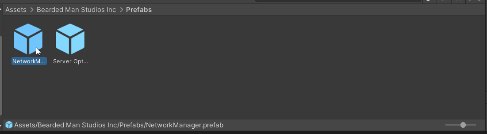

Networking in Unity
===================
v1.0, Joseph Walton-Rivers <joseph.waltonrivers@falmouth.ac.uk>
:experimental:

Note, this tutorial is based off the introduction to using Forge Networking Remastered, but includes custom content. If you are curious about more advanced features of the library you can check out other tutorials on their github wiki.

== Downloading the asset
image::unity_search.png[]
For this session, we'll be using a third-party asset to take care of the low-level networking for us (without it, we wouldn't get through what we need in the session!). To download the asset, go to the asset store (accessed via menu:window[Asset Store] ).

In the search box, type, "Forge Networking". You should be able to find the asset named, "Forge networking Remastered". It should be listed as free, click on the asset and download it. Once it's downloaded import it into your project using the Import button.

TIP: You may need a unity account for this step if you don't already have one.

When you've selected, "import" unity will prompt you to import the asset files. Click the import button on this screen. The package includes a tool that integrates into Unity and some scenes that we'll use later for configuring our clients and servers.

Once imported you get a little box with a bunch of links, you can ignore this. Just close it. You can also tick the "don't close on start" box to avoid it coming up again.

== Part1: Spinning cubes
Taking a leaf from the other Unity workshops running this term, I've decided we'll start with something similar to the "make a cube spin" example. However, ours will be networked!

=== Using Contract Wizard
Although Forge Remastered will take care of the low-level details for us, the high-level details are left up to us. The way in which the system works is that it creates a series of pre-generated scripts that are kept in sync between the client and the servers. We can then use these scripts in our code to keep objects in sync.

First, we need to tell it what to generate. Once imported correctly, a new menu item will appear in the "Window" menu named forge networking. Open the menu:window[forge networking > Network Contract Wizard] from this menu.

=== Creating our first object

A new box will appear. This box is how we tell it what scripts to generate for us. Some sample scripts are already provided. These might be useful for you later, but for now we'll ignore them.

We'll be creating a new 'Contract' for use in our sample scene. To do this we'll click on the 'Create' button. A new window should appear outlining fields and remote prodcedure calls. For now, we'll focus on the fields. We can look at RPC later on.

Let's give our new script a name. Because this will be used as part of a C# class, we shouldn't use class name rules for naming it (no spaces, CamelCase). I've called mine CubeSpinner because we'll be using it to spin and move cubes!

Create two fields, these will be used to store the rotation and position of the cube in question. Set the two fields up as follows:

|===
|Variable |Type |Interpolate |Amount

|Position
|VECTOR3
|yes
|0.15

|Rotation
|QUARTERNION
|yes
|0.15
|===

After you have done this, your window should look something like the one pictured.

When you're happy with the results, press the "save & compile" button. This will generate a C# script we can use later on.

== Creating our Scene
In your scene, create a new plane. We'll use this as the floor for our scene. Give it a reasonable size by altering it's scale (something like 25x25) will be fine.

Create a new cube in your scene. This will represent our player object. You can leave it's size and rotation alone. Position it so it's not clipping though the floor (above it). Add a rigid body to the object.

=== Scripting
Create a new script on your player cube. I've called mine CubeSpinner, open the script in visual studio. As most scripts in Unity do, it will extend MonoBehavior. We'll want our script to extend the class the wizard created for us. To do this we need to do two things:

1. add a using statement to tell Unity where to find the script
2. Change MonoBehavior to CubeSpinnerBehavior.

NOTE: When the wizard created our script, it named it _name_Behavior, as I named the contract, 'CubeSpinner', the generated class was called 'CubeSpinnerBehavior'. You can find the generated code in your project under `Bearded Man Studios Inc/Scripts/Generated`.

=== Adding behaviours
At the moment, our object won't do anything unusual. This is because we're not currently doing anything with the networking system. We'll fix this now by adding some simple behaviours to our object.

In onUpdate we'll want our script to do a few things:

1. If the network object isn't ready yet, do nothing
2. If we don't 'own' the object, update it's position based on where the network says it us
3. If we do own the object, let the player move it using the standard unity controls.

.CubeSpinner.cs
[source,csharp]
----
using System.Collections;
using System.Collections.Generic;
using UnityEngine;

using BeardedManStudios.Forge.Networking.Generated;

public class CubeSpinner : CubeSpinnerBehavior
{
    float speed = 15;

    // Start is called before the first frame update
    void Start()
    {
        
    }
    

    // Update is called once per frame
    void Update()
    {
        // check if the network object exists, if not, then return
        if (networkObject == null)
        {
            return;
        }

        // if we are not the owner, just update from the network object directly
        if (!networkObject.IsOwner)
        {
            transform.position = networkObject.position;
            transform.rotation = networkObject.rotation;
            return;
        }

        // update the cube position using the standard unity axis
        transform.position += new Vector3(Input.GetAxis("Horizontal"), 0, Input.GetAxis("Vertical")).normalized * speed * Time.deltaTime;

        // if we're the owner, we need to update the network object to tell everyone else
        networkObject.position = transform.position;
        networkObject.rotation = transform.rotation;
    }
}
----

Forge will take care of ensuring that messages are sent between the clients and server noting when things have changed, but only for the fields we've updated! Anything we don't update won't be synced between clients!

=== Testing our script
Save your scene if you haven't already (you should have!).

Add a rigid body to our player. This is so we can interact with physics. It's often not good practice to alter the transform of physics objects directly, but for what we're doing it won't matter too much. Note in play mode your cube probably won't move. This is because the networking system isnt't currently in use.

== Building our game
To test out our functionality, we'll build our game and make sure we can run two copies of it at once. Note that you can use the version in the editor as one of the copies.

=== Adding scenes
Open build settings from the menu. In the "Scenes in build" section we'll want to add two scenes:

1. The MultiplayerMenu scene from Forge (remember I said we'll be using them later!)
2. Your game scene

image::unity_scenelist.png[]

[TIP]
.The MultiplayerMenu scene
====
If you can't find the MultiplayerMenu scene, it's located in, `Bearded Man Studios Inc/Scenes as MultiplayerMenu`. You can drag the scenes from the assets panel to the "scenes in build" section to add them. Make sure that the MultiplayerMenu scene is first!

====

We need to make sure we can open multiple copies of our game for testing and that they don't go to sleep when they're running. Ensure that the game is allowed to run in the background by ticking  menu:resolution and presentation[resolution > run in background*] - found by clicking the "player settings" button.

=== Testing our game
We're ready to test our game. Build and run the game. You'll want two copies open. If you want one of those copies to be the unity editor make sure you run the game from the "MultiplayerMenu" scene.

The game should start and you should see the Forge Multiplayer Menu. It has two options, "Host" and "Connect". The player that chooses "Host" will be the server, have one of your game instances act as a server and one as a client.

NOTE: at the moment you may find the game only works on localhost (127.0.0.1) - this is fine, there is a lot of complexity we're skipping over to do with networking (NATs, Ports, etc...). Once advantage of using a server in the cloud is you don't need to worry about port forwarding!

Once both players are connected, the 'server' should be able to move the cube, but the client won't be able to (as they don't own it). The movements the server makes should be reflected on the client.

== Part 2: Object Creation
At the moment our environment is pretty one-sided. The server has a 'character' they can control, but our clients are basically spectators. In this section we're going to modify our game to create player objects when the clients connect. This will mean that they'll each get a cube of their very own.

=== Making the player a prefab

We can tell the networking library to create an object from a prefab when a player connects. Select your cube in the hierarchy and drag it into your project panel. This should make it into a prefab in the folder you dragged it into.

Now we've made it into a prefab, we need to tell the Networking library that the prefab we just created should be used for our contract. To do this we'll need the Network Manager prefab.

TIP: This is part of forged so you might need to search for it to find it! It should be in the "prefabs" folder inside forge.

In your project window find the network prefab and select it. Don't add it to your scene, we want to edit the prefab in place! Select the prefab and find the field named, "CubeSpinner Network Object", put your prefab in this list. The name is based off of the contract name, so if you called it something different your name will be different.

* Change the size to 1
* Drag your prefab from the project bin into your project.

NOTE: you shouldn't copy the network manager prefab into your scene, you want to alter the prefab outside of your scene.

If you still have your player prefab in the scene, either delete it or deactivate it.

=== Creating game logic
We'll now create the part that actually does the spawning of the player.

In your scene, create a new empty game object called GameLogic. We'll use this as a holder for scripts that need to exist when the game starts.
An empty game object just has a transform component by default.

Create a new script on this object. I've called mine GameLogic. When the game starts, we'll use the method to create a game object for the player. 

The script will be calling the network manager object and creating the instance for us.

.GameLogic.cs
----
using UnityEngine;
using BeardedManStudios.Forge.Networking.Unity;

public class GameLogic : MonoBehaviour
{
	private void Start()
	{
		NetworkManager.Instance.InstantiatePlayerCube();
	}
}
----

=== Test your game
Save and build your game again. You should now get one player cube per client (and the server gets one to!).

== PART 3: Remote Prodecure Calls

Sometimes, rather than syncing fields like this, it's better for us to call methods on objects. This allows us to do something as-needed than once per update like we are at the moment.

Modify our player contract ( CubeSpinner ) to include an remote prodecure call (RPC) method. The method should take a single string as an argument and should have a name like, "playerJoined". Regerenate the contract.

we can use the `SendRpc` method to send Rpc events to other players.

=== Creating our contract
We need to modify our Player contract to include an RPC method. This example is a little trivial, but you could use it for more advanced things to (such as removing the physics bug I've introduced by altering the transform directly).

Open the forge window we used before. This time we'll be adding RPC call. 

Use the Add RPC button and modify the name. I've called it UpdateName, this will be reflected in the method you need to override later, so make sure it matches :).

Once you've added the name, we'll add an argument (things passed to it like a function). Our argument will be of type String (and I've called it name).

After you've made those changes, save the contract and forge will regenerate the class it made for us.

=== Adding methods to our script
We've got the call as part of our contract but we've not used it yet. Now we'll add the call to our code.

There are two parts we need to implement. Firstly, we'll need to _call_ the method when needed. Secondly, we'll need to _override_ the callback so we are informed when the RPC method is _invoked_.

While we're modifying the script, we'll remove the rigid body if we're not the owner. This will mean that the physics will only be simulated on one machine, and the results will be synced to the others.

[code, csharp]
----
using BeardedManStudios.Forge.Networking;
using BeardedManStudios.Forge.Networking.Generated;

using UnityEngine;

// We extend PlayerBehavior which extends NetworkBehavior which extends MonoBehaviour
public class CubeSpinner : CubeSpinnerBehavior
{
	// These strings are to be used to construct a player's name
	// by randomly combining 2 strings
	private string[] nameParts = new string[] { 
				"pigeon", "cat", "dog", "red", "blue", "green", 
				"unity", "unreal" };

	public string displayName { get; private set; }

	
	// NetworkStart() is **automatically** called, when a networkObject 
	// has been fully setup on the network and ready/finalized on the network!
	// In simpler words, think of it like Unity's Start() but for the network ;)
	protected override void NetworkStart()
	{
		base.NetworkStart();

		// If this networkObject is actually the **enemy** Player
		// hence not the one we will control and own
		if (!networkObject.IsOwner)
		{
			// There is no reason to try and simulate physics since 
			// the position is being sent across the network anyway
			Destroy(GetComponent<Rigidbody>());
		}

		// Assign the name when this object is setup on the network
		ChangeName();
	}

	public void ChangeName()
	{
		// Only the owning client of this object can assign the name
		if (!networkObject.IsOwner)
			return;

		// Get a random index for the first name
		int first = Random.Range(0, nameParts.Length - 1);
		// Get a random index for the last name
		int last = Random.Range(0, nameParts.Length - 1);

		// Assign the name to the random selection
		displayName = nameParts[first] + " " + nameParts[last];

		// Send an RPC to let everyone know what the name is for this player
		// We use "AllBuffered" so that if people come late they will get the
		// latest name for this object
		// We pass in "Name" for the args because we have 1 argument that 
		// is to be a string as it is set in the NCW
		networkObject.SendRpc(RPC_UPDATE_NAME, Receivers.AllBuffered, displayName);
	}

	// Default Unity update method
	private void Update()
	{
		// Update position as before
	}

	// Override the abstract RPC method for the contract, this will get called when the sendRPC event happens
	public override void UpdateName(RpcArgs args)
	{
		// Since there is only 1 argument and it is a string we can safely
		// cast the first argument to a string, knowing that it is going to
		// be the name for this player
		displayName = args.GetNext<string>();
	}
}
----

NOTE: because we're not showing the name anywhere, it's not easy to check this worked! If one of your clients is Unity itself you can use the inspector to see the names.

=== Extention: Make the change visible
As an extention task, you could make this change more visible. For example, you could add the current player's name to a label on screen, or you could change the code to assign a random material rather than name.

TIP: for real world applications, don't use colour alone to communicate infomation - as doing so may make your application hard to use for colour blind people!

== PART 4: Experimenting with sync
I mentioned before that only things that you update yourself using the network object (or update using RPC) will be synced between games. Lets try this out now to see how it works.

We'll be creating an object that we deliberatly don't sync correctly between the clients to see what happens.
After we've experimented to see what happens, we'll fix it to make sure we can sync stuff correctly.

=== Another object
In your scene, add another object. This time make it a sphere as we'll want it to roll about. We'll be moving the object using physics (the player will be running into it) so it'll need a rigid body.

We'll not add any code to sync it using a networkObject, but we'll see what happens.

Save and rebuild and try moving your player object into the ball. What happens?

*Q:* When batting the ball around you may note that it looks very much like the object is being synced. I said that anything that's not explicitly synced isn't maintained, so what's going on?

*A:* Because the player position is being synced, both the client and the server are calculating the result of the physics interactions indipendently. The ball is only affected by the movement of the player so the balls will (largely) stay in sync. Note this might not always be the case (numerical rounding errors between operating systems, network lag, other objects that aren't being synced correctly). 

We'll demonstate this effect by introducing a little more chaos into our scene. Whenever the player hits the ball we'll make it resize by a random amount. Because we're not syncing the random number generators this should very quickly make the two versions (client and server) go out of sync!

NOTE: Not syncing objects correctly can lead to suble bugs when physics updates differ (between machines, operating systems, updates in different order, etc...). To demonstate this we'll try introducing a bug into our game.

=== Resizing the ball
To show the effects of not syncing correctly, we're going to make our ball randomly change size when the player interacts with it.

To do this:

* Tag the player cube with the "Player" tag (then we can make sure it doesn't resize when hitting the floor).
* add a new script to the Ball, give it a suitable name (e.g. `BallResizer`)

When the ball collides with the player, make the ball's scale change randomly. _Hint_: you can use Random.value to get a random number between 0 .. 1 inclusive. You can use my code below if you get stuck.

.BallResizer.cs
[source,csharp]
----
using System.Collections;
using System.Collections.Generic;
using UnityEngine;

public class BallResizer : MonoBehaviour
{
    private Random random;

    // Start is called before the first frame update
    void Start()
    {
        random = new Random();
    }

    // Update is called once per frame
    void Update()
    {

    }

    public void OnCollisionEnter(Collision collision)
    {
        if (collision.gameObject.tag == "Player")
        {
            Vector3 scaleChange = new Vector3(
                Random.value,
                Random.value,
                Random.value
            );

            gameObject.transform.localScale = scaleChange;
        }
    }
    
}
----

=== Testing out the changes
Rebuild your game and connect a host/server and client.

Have the host knock into the ball. The client and server should now be different. The more the player moves and causes collisions, the worse out of sync they will become!

=== Keeping the ball in sync
To fix this, we'll be removing the client-side logic for physics from the ball. Only the owner will perform the physics calcuations and then update the clients based on what it calcuates. In other words, we're making the owner of the object (the server) _authoritative_.

Create a new network contract to sync the position and scale of the ball. I've called mine _GameBall_, but you can call it anything that makes sense.

|===
|Variable |Type |Interpolate |Amount

|Position
|VECTOR3
|yes
|0.15

|Scale
|VECTOR3
|yes
|0.15
|===

==== Adding behaviour

*TASK:* Use what you learnt in part 1 (keeping network objects in sync) to only allow the server to update the ball's size.

NOTE: you need to check if the ball is 'owned' by the server in both the collision and the update methods. If the collision happens on the client, we'll still let it bounce around but the resizing and position will be controlled by the server.

[source,csharp]
----
using System.Collections;
using System.Collections.Generic;
using UnityEngine;

// Don't forget the namespaces!
using BeardedManStudios.Forge.Networking;
using BeardedManStudios.Forge.Networking.Generated;
using BeardedManStudios.Forge.Networking.Unity;

public class BallResizer : GameBallBehavior
{
    private Random random;

    // Start is called before the first frame update
    void Start()
    {
        random = new Random();
    }

    // Update is called once per frame
    void Update()
    {
	// TODO write your new code here
	// if you're not sure what to do, have a look at Part 1 again :).
	// Note, we're syncing the scale not the rotation this time!
    }

    public void OnCollisionEnter(Collision collision)
    {
    	// only the server can do ball resizing
    	if (!networkObject.IsOwner) {
    		return;
    	}
    
    	// if the ball collides with a player, resize!
        if (collision.gameObject.tag == "Player")
        {
            Vector3 scaleChange = new Vector3(
                Random.value,
                Random.value,
                Random.value
            );

            gameObject.transform.localScale = scaleChange;
        }
    }
    
}
----

=== Test your game
Test your game, the ball should remain in sync between the server and the clients now.

=== Adding more behaviour
Our scene is functional, but it's not really a _game_ at the moment. 

There are lots of ways in which you could adapt this example:

* Multi-player roll-a-ball
* Simple football style game
* Chase the ball around the level, first one to touch it scores a point

Modify our GameLogic contract to add a new RPC method called PlayerScored that takes a string as an argument. When the player comes into contact with the ball, we'll trigger the method. Exactly what this method does is up to you. A good test might be showing the result in a label on the screen.

I've included an example game ball script from the github tutorials by the library's author to get you started. I've modified it a little to match the approaches I've used elsewhere in the script.

[source,csharp]
----

// Don't forget the namespaces!
using BeardedManStudios.Forge.Networking;
using BeardedManStudios.Forge.Networking.Generated;
using BeardedManStudios.Forge.Networking.Unity;

public class GameBall : GameBallBehavior
{
	private Rigidbody rigidbodyRef;
	private GameLogic gameLogic;

	private void Awake()
	{
		rigidbodyRef = GetComponent<Rigidbody>();
		
		//NOTE: if your game logic script is called something else, you might need to change this!
		gameLogic = FindObjectOfType<GameLogic>();
	}

	// Default Unity update method
	private void Update()
	{
		// Check to see if we are the owner of this ball
		if (!networkObject.IsOwner)
		{
			// If we are not the owner then we set the position to the
			// position that is syndicated across the network
 			// for this ball
			transform.position = networkObject.position;
			return;
		}

		// Registers and syndicates transform.position  
                // across the network, on the next update pass
		networkObject.position = transform.position;
	}

	private void OnCollisionEnter(Collision triggeringCollision)
	{
		// We are making this authoritative by only
		// allowing the server to call it
		if (!networkObject.IsServer)
			return;

		// Only continue, if a player touches the ball
		// otherwise normal collision/bounciness happens.
		if (triggeringCollision.gameObject.tag != "Player")
			return;

		// **Call an RPC from gameLogic** to print the player's name 
		// as the last player to touch the ball
		gameLogic.networkObject.SendRpc(
                	GameLogicBehavior.RPC_PLAYER_SCORED,
			Receivers.All,
			triggeringCollision.gameObject.GetComponent<CubeSpinner>().Name
		);

		// Reset the ball
		Reset();
	}

        /* Minor note on this function:
        /// Check out the invokes and references of this function.
        /// This function is called always from a server.
        /// 
        /// The velocity or force dont matter for other clients
        /// since the server relays the **position** across the network.
        /// And we only really care about the position.
        */
	public void Reset()
	{
		// Move the ball to 0, 10, 0
		transform.position = Vector3.up * 10;

		// Reset the velocity for this object to zero
		rigidbodyRef.velocity = Vector3.zero;

		// Create a random force to apply to this object 
		// between 300 to 500 or -300 to -500
		Vector3 force = new Vector3(0, 0, 0);
		force.x = Random.Range(300, 500);
		force.z = Random.Range(300, 500);

		// 50% chance to make the force.x inverted/negative.
		if (Random.value < 0.5f)
			force.x *= -1;

		// 50% chance to make the force.z inverted/negative.
		if (Random.value < 0.5f)
			force.z *= -1;

		// Add the random force to the ball
		rigidbodyRef.AddForce(force);
	}
}
----

=== Triggering the start of game
We'll use a special object to start the game. When this object it touched it will start the game for all the players. We'll configure it so the server is the only one that can interact with the the object so that when it triggers, they'll own the ball.

* Make your ball into a prefab and attach it to the network manager if you have not done so already

Create a new object in your scene, what the object is is up to you, but make sure it has a collider that is marked as a trigger.
You can use the script below to create your object.

----
using BeardedManStudios.Forge.Networking.Unity;
using UnityEngine;

// Do note that this script is just a Monobehaviour
// but we have access to NetworkManager.Instance which is very helpful!
public class StartTrigger : MonoBehaviour
{

	private void Update()
	{
		// If the game started we will remove this trigger from the scene
		if (FindObjectOfType<GameBall>() != null)
			Destroy(gameObject);
	}

	private void OnTriggerEnter(Collider triggeringCollider)
	{

		// Only allow the server player to start the game 
		// so the server is the owner of the ball
		// because if a client is the owner of the ball
		// and that client disconnects, the ball will be destroyed.
		if (!NetworkManager.Instance.IsServer)
			return;

		// We detect if the colliding gameobject has
		// the Component/Script Player.cs and if it doesn't have it
		// we simply don't do anything by using return;
		if (triggeringCollision.gameObject.tag != "Player")
                	return;

		// We need to create the ball on the network
		GameBall ball = NetworkManager.Instance.InstantiateGameBall() as GameBall;
		
		// reset the ball to give it a random velocity
		ball.Reset();

		// We destroy this trigger gameobject since we dont need it anymore.
		// This gameobject is destroyed only for the server.
		// However, it is destroyed for the client via Update() because
		// the ball is spawned.
		Destroy(gameObject);
	}
}
----

Notice we're using the ``InstantiateGameBall()`` method in the network manager. This will create the prefab from our network manager. Just like we did for the player. Make sure you add a ball prefab to the network manager!

Remove the ball we were using for our tests so the ball only exists when the trigger creates it.

TIP: if you can't remember how to add an object to the network manager, look at part 2 again.

=== Build your game
Build and test your game again. You should notice that ball is created when the server player touches your start trigger. Check that your collision works as expected.

If you have time, you can make it a better game by adding more features or adding walls and a moving camera. I've deliberately left it quite bare-bones.
