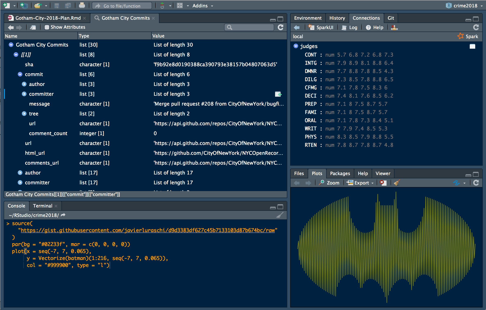
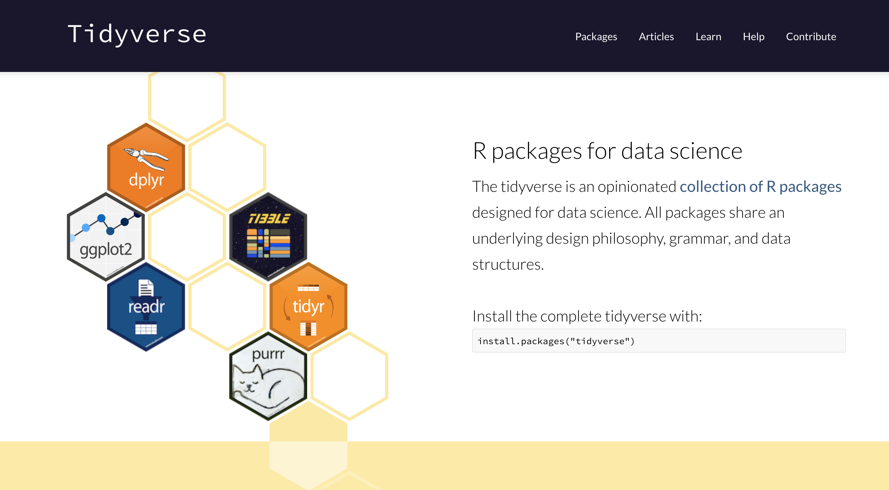
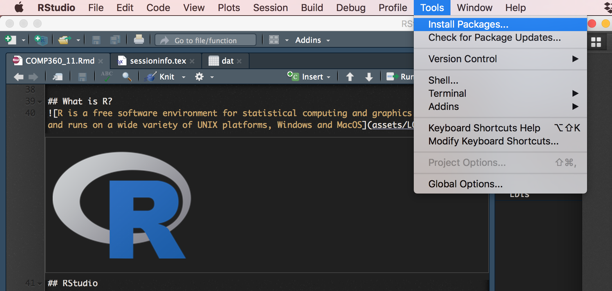
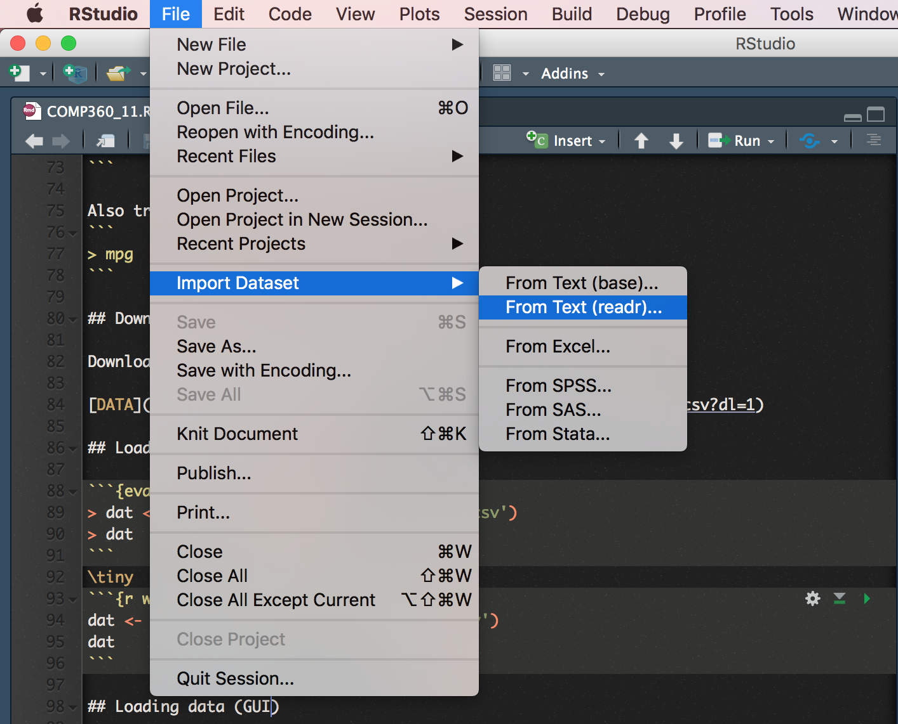
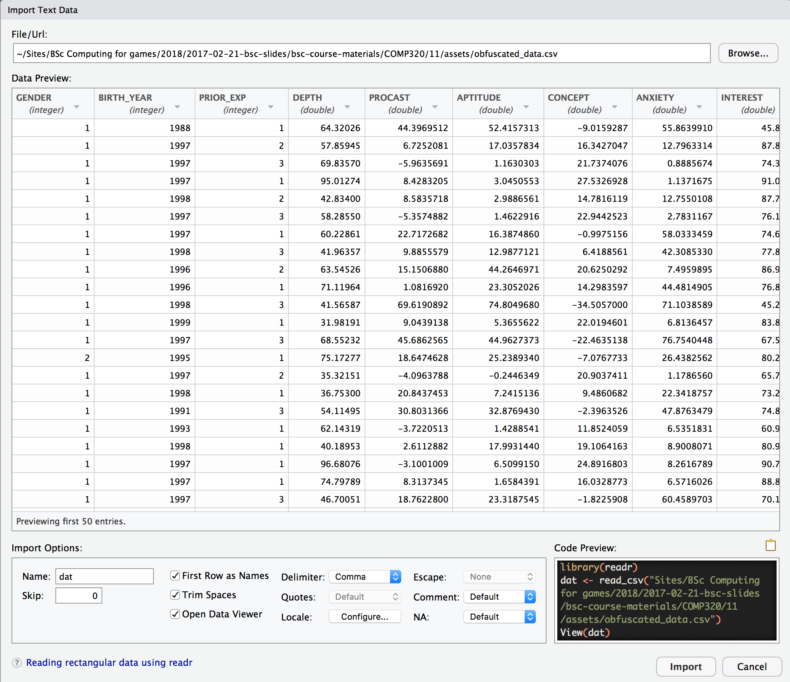
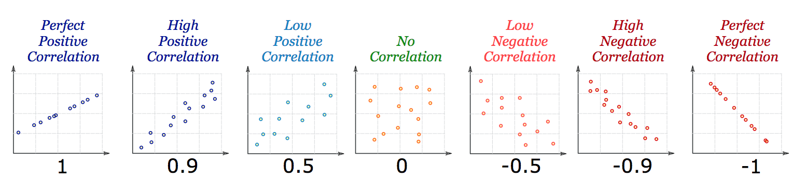
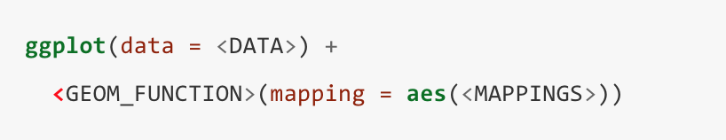

```{r setup, include=FALSE}
knitr::opts_chunk$set(echo = FALSE, dev = 'pdf')

```

\title{\sessionnumber:  Visualising Data in R}
\subtitle{\modulecode: \moduletitle}

\frame{\titlepage} 

## Register Attendance


## Learning Outcomes 
After this session you will be able to:

- **Import** data for analysis in R
- **Analyse** data in R
- **Visualise** data in R

## What is R?


## RStudio
\


## Tidyverse


## Psych


## Installing Packages



## Importing Packages

```
> library(psych)
> library(tidyverse)
```

\tiny
```{r}
library(psych)
library(tidyverse)
```


## Data
R and Tidyverse come packaged with some interesting datasets. Try:
```
> data()
```

Also try viewing a 'dataframe': 
```
> mpg
```

## Download Data

Download and inspect this comma-seperated values (CSV) file:

\huge

[DATA](https://www.dropbox.com/s/6x44olpr3kwdkkh/obfuscated_data.csv?dl=1)


## Loading data

```{eval=FALSE, echo=TRUE}
> dat <- read_csv('assets/obfuscated_data.csv')
> dat
```
\tiny
```{r warning=FALSE, message=FALSE}
dat <- read_csv('assets/obfuscated_data.csv')
dat
```

## Loading data (GUI) STEP 1
\


## Loading data (GUI) STEP 2
\


## Summary
```
> summary(dat)
```

\tiny
```{r warning=FALSE, message=FALSE}
summary(dat)
```

## Describe
```
> describe(dat$PROCAST)
```

\tiny
```{r warning=FALSE, message=FALSE}
library(psych)
describe(dat$PROCAST)
```

## Correlation
```
cor(x, y)
cor.test(x, y, method)
```

```
> cor.test(dat$PROCAST, dat$APTITUDE, method="pearson")
```

\tiny
```{r message=TRUE, warning=TRUE}
cor.test(dat$PROCAST, dat$APTITUDE, method="pearson")
```

## P-Value 
What does this value mean?

\huge
$$ < 2.2e-16 $$


## P-Value 
What does this value mean?

$$ p < 2.2*10-16 $$  

numerically undistinguishable from 0

## Correlation Results
Null Hypothesis: There is no **relationship** between PROCAST and APTITUDE

Result: **Refute** the null hypothesis and **accept** the alternative hypothesis  

- Correlation Coefficient: 0.6156
- P-Value: 2.2 X 10 ^ -16





## T-Test
```
> t.test(dat$ANXIETY~dat$GENDER)
```

```{r}
t.test(dat$ANXIETY~dat$GENDER)
```

## T-Test Results
Null Hypothesis: There is no **relationship** between GENDER and ANXIETY

Result: **Accept** the null hypothesis 

- P-Value: 0.3385


## Information Presentation 
- There are various techniques for reformatting and reducing data to make the analysis more interpretable or to illustrate a key point
-  Graphical representations will also assist in decision making and reinforce the justification for those decisions e.g., has a hypothesis been falsified? To what extent is it clearly falsified?
- An overall picture of the data can be gleaned and initial conclusions drawn
- It is important to select the most effective ways to illustrate your findings in the dissertation

## Information Presentation 
- Your communication skills are under assessment; keep all graphical depiction meaningful to justifying your analysis and/or your intellectual decisions
- Provides an overall picture of the data underlying your findings to reach and support your conclusions
- Be wary of delegating charts solely to important data:
    + Depictions can distort message of original data 
    + Concise, but often lacks precision
    + Ensure adequate support in body of text
    + Leverage explicit references (e.g., “as shown in Figure 1”)

## 

- Bar Chart
- Histogram
- Frequency Polygon
- Cummaltive Frequency Polygon (Ogive)
- Pie Chart
- Scatter Plot
- Box Plot

## ggplot


## Bar Chart in R
```
> ggplot(dat, aes(GENDER)) + geom_bar()
```

```{r}
ggplot(dat, aes(GENDER)) + geom_bar()
```


## Complex Bar Chart
) ](assets/complexbar.png)

## Histogram
- A type of vertical bar chart used to depict a frequency distribution
- Construction steps:
    + Label the **x** axis with the class endpoints
    + Label the **y** axis with the frequencies
    + Label the chart with an appropriate title, i.e. not 'bar chart'
- A quick look at the histogram reveals which class intervals produce the highest frequency totals E.g. which age group most often enrols in undergraduate computing courses?

## Histogram in R
```
> ggplot(dat, aes(BIRTH_YEAR)) + geom_histogram(
  breaks=seq(1970, 2000, by =5), 
  fill="red", 
  aes(alpha = ..count..)) + 
  labs(x = "Year of Birth", 
    y = "Count", 
    title = "Breakdown of Birth Years")
```

## Histogram Output
```{r}
ggplot(
  dat, aes(BIRTH_YEAR)) + geom_histogram(
  breaks=seq(1970, 2000, by =5), 
  fill="red", 
  aes(alpha = ..count..)
) + labs(
  x = "Year of Birth", 
  y = "Count", 
  title = "Breakdown of Birth Years")
```

## Frequency Polygon
- A graph in which line segments connecting the dots depict a frequency distribution
- Construction steps:
    + Label the **x** axis with the class endpoints
    + Label the **y** axis with the frequencies
    + Plot a dot for the frequency value at the midpoint of each class interval
    + Connect the dots with a line
    
## Frequency Polygon in R

```
> ggplot(dat, aes(CONSCIENTIOUSNESS), stat="count") 
  + geom_freqpoly(binwidth = 20) 
  + labs(
    x = "Year of Birth", 
    y = "Count", 
    title = "Breakdown of Birth Years")
```
## Frequency Polygon Output

```{r}
ggplot(dat, aes(CONSCIENTIOUSNESS), stat="count") + geom_freqpoly(binwidth = 20) + labs(x = "Level of Conscientiousness", y = "Count", title = "Breakdown of Conscientiousness")
```

## OGive 
- A Cumulative Frequency (CF) polygon
- Construction steps:
    + Label the x axis with the class endpoints
    + Label the y axis with the cumulative frequencies
    + A dot of ‘0’ is placed at the beginning of the first class
    + Mark a dot for the CF value at the end of each class interval
    + Connect these dots with a line

## OGive in R
To construct an ogive, you need to format the data into cumulative frequencies:
```
cf <- c(0, cumsum(
  table(
    cut(dat$CONSCIENTIOUSNESS, seq(0, 240, by=20), 
    right=FALSE))))
```
Then plot the chart based on this data:
```
plot(seq(0, 240, by=20), 
  cf, 
  main="Range of Conscientiousness", 
  xlab="Level of Conscientiousness", 
  ylab="Cumulative Frequency") 
    + lines(seq(0, 240, by=20), cf)

```

## OGive Output
\tiny
```{r message=FALSE}
par(bg = "white")
cf <- c(0, cumsum(table(cut(dat$CONSCIENTIOUSNESS, seq(0, 240, by=20), right=FALSE))))
plot(seq(0, 240, by=20), cf, main="Range of Conscientiousness", xlab="Level of Conscientiousness",
ylab="Cumulative Frequency") + lines(seq(0, 240, by=20), cf)

```

## Pie Chart
- A circular depiction of data where the area of the whole pie = 100% of the data being studied.
- Slices represent a % breakdown of each of the values 
- Business uses: e.g. for depicting budget categories, market share, time and resource allocation
- Generally more difficult to interpret the size of the slices compared to the bars in a histogram. But- usage of ‘%’ can clarify slice size

## Construction steps
1. Convert each toothpaste brand amount to a proportion by dividing each individual amount by the total
$$ 102 / 200 = 0.51 $$

2. Convert each proportion to degrees by multiplying by 360°
$$ 0.51 * 360 = 183.6 $$

## Pie Chart in R
```
Lbls <- c(
  "Prior Experience with Pre-University Qualification", 
  "Prior Experience without Pre-University Qualification", 
  "No Prior Experience")

pieValues <- as.data.frame(table(dat$PRIOR_EXP))

pieValues$labels = Lbls

pie(
  pieValues$Freq, 
  labels = pieValues$labels, 
  main="Pie Chart of Countries")
```

## Pie Chart Output
```{r}
par(bg = "white")
Lbls <- c("Prior Experience with Pre-University Qualification", "Prior Experience without Pre-University Qualification", "No Prior Experience")

# count the number of times a value x appears in the vector
pieValues <- as.data.frame(table(dat$PRIOR_EXP))

# add the labels as new column to dataframe
pieValues$labels = Lbls


pie(pieValues$Freq, labels = pieValues$labels, main="Pie Chart of Countries")
```

## Scatter Plot
- Illustrates the relationship between two variables based on its underlying data points
- E.g. the link between neurotic personality traits and programming anxiety
- Scatter graph - a two-dimensional graph plot of pairs of points from two variables
- Relationships will vary in strength, line of best fit used to indicate magnitude through slope

## Scatter Plot in R
```
ggplot(dat, aes(x=ANXIETY, y=NEUROTICISM)) +
    geom_point(shape=1) +   
    geom_smooth(method=lm,   
                se=FALSE)    
```

## Scatter Plot Output
```{r message=FALSE}
ggplot(dat, aes(x=ANXIETY, y=NEUROTICISM)) +
    geom_point(shape=1) +    # Use hollow circles
    geom_smooth(method=lm,   # Add linear regression line
                se=FALSE)    # Don't add shaded confidence region
```


## Box Plot in R
```
dat$P_EXP <- factor(
  dat$PRIOR_EXP, 
  labels = c(
    "Prior (qualified)", 
    "Prior (unqualified)", 
    "No Prior"))

ggplot(dat, aes(x = P_EXP, y = ANXIETY)) +
  geom_boxplot() + 
  labs(
    x = "Level of experience", 
    y = "Anxiety", 
    title = "Anxiety of Students")
```

## Box Plots Output
```{R message=FALSE}
# add the labels as a new column
dat$P_EXP <- factor(dat$PRIOR_EXP, labels = c("Prior (qualified)", "Prior (unqualified)", "No Prior"))

ggplot(dat, aes(x = P_EXP, y = ANXIETY)) +
  geom_boxplot() + 
  labs(x = "Level of experience", y = "Anxiety", title = "Anxiety of Students from Different Backgrounds")
```

## Further Reading
- [Official Docs](https://www.rdocumentation.org/)
- [Stat Methods](https://www.statmethods.net/)
- [Harvard Tutorial Series](http://tutorials.iq.harvard.edu/R/)
- [R Studio Docs](https://support.rstudio.com/hc/en-us)
- [R Markdown Docs](https://rmarkdown.rstudio.com/lesson-1.html)

## The Book

 ](assets/book.png)