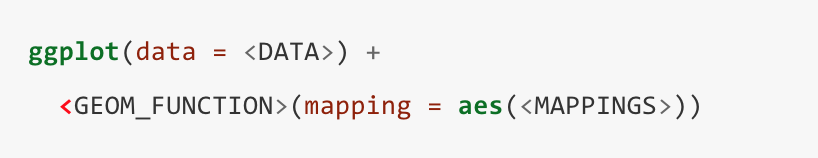

```{r setup, include=FALSE}
knitr::opts_chunk$set(echo = FALSE, dev = 'pdf')

```

\title{\sessionnumber:  Visualising Data in R}
\subtitle{\modulecode: \moduletitle}

\frame{\titlepage} 

## The Book
 ](assets/book.png)

## What is R?

## Load Tidyverse
\small
```
> library(tidyverse)
```
```{r}
library(tidyverse)
```


## Data Frame

```
> mpg
```
\tiny
```{r}
mpg
```

## Loading data

```{eval=FALSE, echo=TRUE}
library(readr)
dat <- read_csv('assets/obfuscated_data.csv')
```
\tiny
```{r warning=FALSE, message=FALSE}
library(readr)
dat <- read_csv('assets/obfuscated_data.csv')
dat
```

## Summary
```
summary(dat)
```

\tiny
```{r warning=FALSE, message=FALSE}
summary(dat)
```

## ggplot
\small
```
ggplot(data = dat) + 
geom_point(mapping = aes(x = BIRTH_YEAR, y = ANXIETY))
```

\begin{figure}
```{r fig.cap='ggplot point graph', fig.align='center', fig.width=4, fig.height=2, echo=FALSE}

ggplot(data = dat) + 
  geom_point(mapping = aes(x = BIRTH_YEAR, y = ANXIETY), size=.2)
```

\end{figure}


## ggplot 




## Correlation
```
> cor(x, y)
> cor.test(x, y, method)
```

```{r message=TRUE, warning=TRUE}
cor(dat$PROCAST, dat$APTITUDE, method="pearson")
```

## T-Test
```{r}
t.test(dat$ANXIETY~dat$GENDER)
```

## Further Reading
- [Official Docs](https://www.rdocumentation.org/)
- [Stat Methods](https://www.statmethods.net/)
- [Harvard Tutorial Series](http://tutorials.iq.harvard.edu/R/)
- [R Studio Docs](https://support.rstudio.com/hc/en-us)
- [R Markdown Docs](https://rmarkdown.rstudio.com/lesson-1.html)

